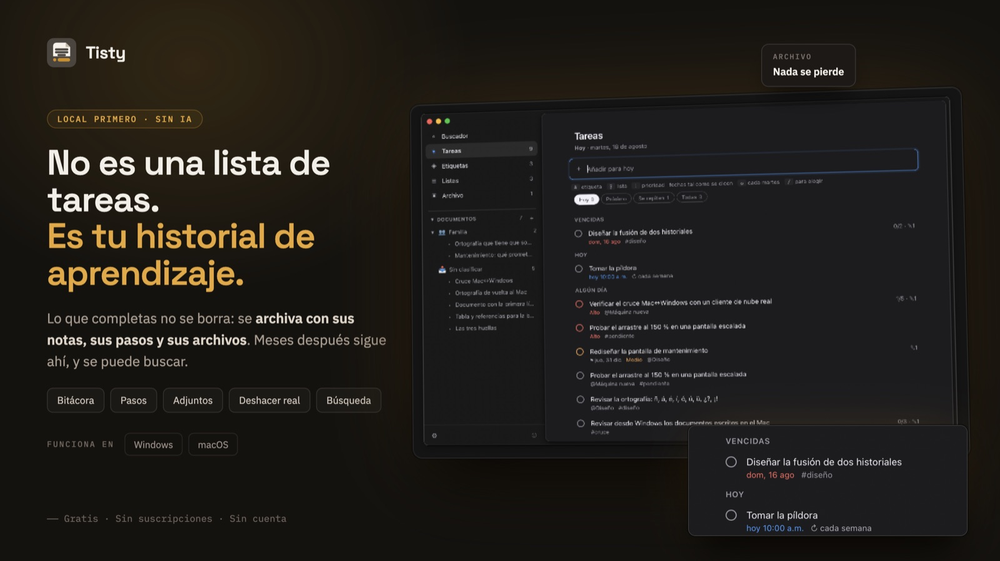
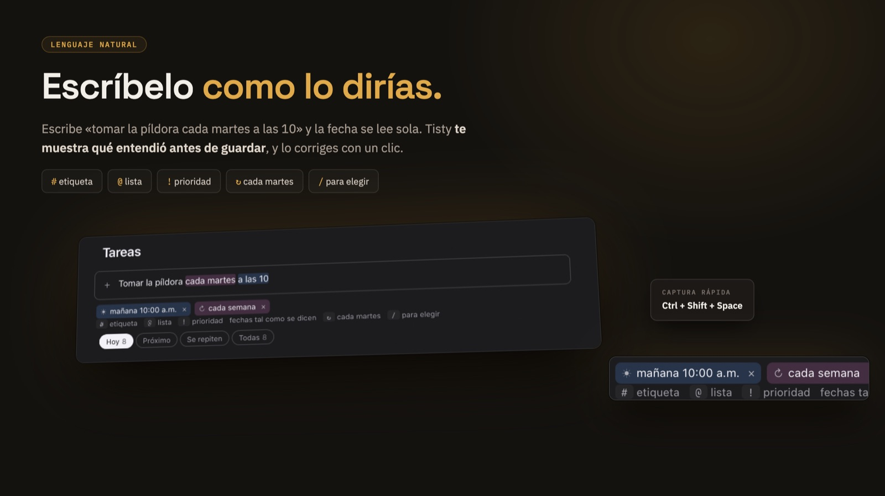
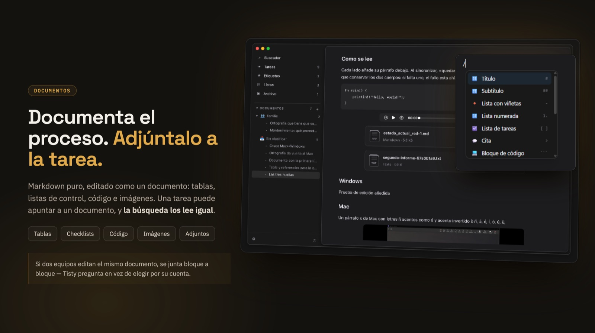
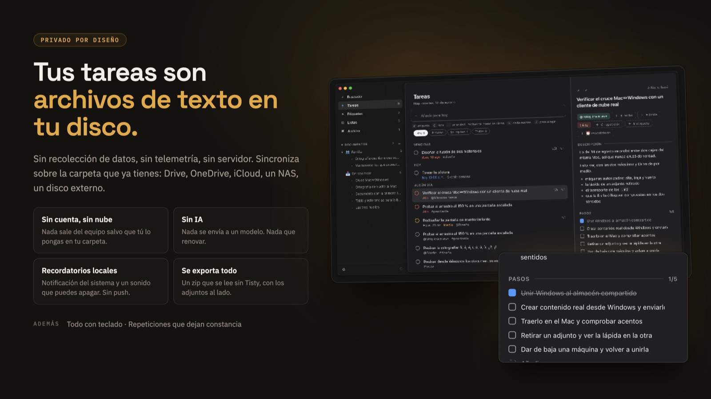

# Tisty

[English](README.md) · **Español**

**Tus tareas dejan algo detrás. Tisty lo conserva.** Un gestor de tareas
personal para macOS y Windows, en tu propio disco y sin cuenta.



## Por qué lo hice

Organizar tu día es más difícil de lo que una lista aparenta. Hay más piezas de
las que caben en la cabeza, los planes se mueven solos, y algo que creías
pequeño resulta que no lo era. Por eso terminarlo se siente bien.

Pero fíjate en lo que esa tarea fue juntando por el camino. Los pasos que de
verdad hubo que dar. Las notas que escribiste mientras lo resolvías. Lo que
consultaste, con qué terminó conectando, los documentos en los que te apoyaste.
Ahí es donde se fue el esfuerzo.

La mía se llamaba *«arreglar los timeouts intermitentes al guardar»*. Cuando
estuvo lista ya llevaba encima el ticket, el commit y dos párrafos explicando
que la causa real era un índice que faltaba en una tabla que nadie miraba.

Ocho meses después pasó lo mismo en otra parte. Me acordaba de haberlo resuelto.
No me acordaba de cómo — y la nota que tenía la respuesta se había ido con el
tache.

**Esa es toda la razón por la que Tisty existe.** Una tarea no es una línea que
se tacha. Es un árbol: los pasos, la bitácora, los archivos y los documentos que
crecieron a su alrededor mientras trabajabas. Terminarla no debería podarlo.

También quería que siguiera siendo mío. En mi disco, en archivos que puedo abrir
sin pedirle permiso a nadie. Así que hice lo que quería tener, lo usé hasta que
dejó de molestarme, y lo dejé acá por si resulta ser lo que tú querías.

## Qué es, y qué no es

**Es** un gestor de tareas personal donde terminar algo es el comienzo de su vida
útil. Las tareas llevan descripción, bitácora, pasos y adjuntos; al completar una
pasa al archivo, y la búsqueda llega a todo, documentos incluidos.

**Es para una persona.** Sin responsables, sin permisos, sin tableros. Si
necesitas llevar un equipo, Tisty no va a sostener eso, y mereces saberlo antes
de instalarlo y no después.

**No es algo que venda.** Nada está bloqueado, nada caduca, y no existe una
versión de esto con más cosas dentro. Es un programa que escribí para mí y
regalé.

**Tus datos son archivos.** Texto plano en tu propio disco, que se lee con `cat`
y se busca con `grep`. Si Tisty desapareciera mañana, todo lo que escribiste
seguiría ahí y seguiría teniendo sentido.

## Para quién es

Para alguien que trabaja solo, o casi siempre solo, y cuyas tareas dejan un
rastro que vale la pena guardar. Desarrolladores, administradores de sistemas,
independientes, gente que investiga, quien estudia — cualquiera que haya
resuelto dos veces el mismo problema y lo haya sabido la segunda vez.

Si lo que quieres es una lista para tachar y no volver a abrir, Tisty te va a
parecer más de lo que pediste. Es un motivo razonable para dejarlo pasar.

## La idea sobre la que está construido

**Una tarea completada no está terminada. Está archivada.**

Deja de ser un recordatorio de qué hacer y pasa a ser el registro de cómo se
resolvió algo. De ahí salen tres cosas, y esas moldearon todo lo demás:

- **La búsqueda es la entrada principal al archivo**, no una función lateral.
- **Borrar es la excepción.** El final normal es completar, que conserva.
- **Capturar tiene que seguir siendo instantáneo**, porque la mayoría de las
  tareas no son así. La llamada que tienes que hacer mañana nace y muere en un
  día y no deja nada que guardar — y anotarla no puede costar más de una línea.

## Instalación

**Windows** — desde la
[Microsoft Store](https://apps.microsoft.com/detail/9PGVWXD8X93N), que además se
encarga de mantenerla al día.

**macOS** — con [Homebrew](https://brew.sh). El tap se agrega una sola vez y no
se vuelve a tocar; desde ahí Tisty se actualiza como cualquier otra cosa que
tengas instalada:

```console
$ brew tap rgdevment/tap
$ brew install --cask tisty
$ brew upgrade --cask tisty
```

O toma la imagen de disco y el instalador directamente de
[Releases](https://github.com/rgdevment/Tisty/releases), en cualquiera de los
dos sistemas.

## Qué hace

**Tres columnas como máximo:** qué estás mirando, la lista, y la tarea que
abriste. Nada más en pantalla.

**Lee lo que escribes.** Escribes una frase y Tisty le saca la fecha, deja la
frase legible, y te muestra qué entendió *antes* de guardar nada — como fichas
que corriges con un clic.



```text
"desplegar mañana a las 10"        →  mañana 10:00
"entregar el informe para viernes" →  límite vie
"reservar vuelos @viaje #urgente"  →  @viaje · #urgente
```

Un día, una hora, o las dos. Nombres, distancias, fechas sueltas. Lo que no
puede leer lo deja tal cual en vez de adivinar. Un límite no es lo mismo que un
plan, y lo abren tres palabras: **antes de**, **para** y **hasta**.

**La tarea se abre al lado de la lista**, no encima: fechas, lista, etiquetas,
prioridad, una descripción y una bitácora en Markdown, pasos que vas marcando de
a uno, y lo que le hayas soltado encima. Completarla no aleja nada de eso.

**Los documentos** viven junto a las tareas, para el material de consulta que no
tiene fecha y nunca se tacha. Son archivos Markdown que editas como documentos
—tablas, listas de control, código, imágenes— y la búsqueda también los lee. Una
tarea puede apuntar a un documento; un documento nunca crea tareas.



**Un atajo global** abre un campo pequeño encima de lo que estés haciendo, así
una tarea que se te ocurre a mitad de algo no te cuesta ese algo.

**Las tareas que se repiten** vuelven de a una ocurrencia, así el archivo te
muestra que la hiciste doce veces. **Los recordatorios** llegan como notificación
del sistema y un sonido corto que puedes apagar. Toda la ventana funciona con el
teclado.

## Tus datos



Todo vive en una carpeta de tu disco: un registro de lo que pasó al que solo se
le agrega, tus documentos como archivos `.md`, y tus adjuntos tal como son. Nada
está ofuscado ni en un formato que solo Tisty pueda leer.

**Nada está cifrado en reposo**, y es una decisión, no un descuido: la protección
son los permisos de tu sistema operativo, y así los archivos siguen siendo
legibles con las herramientas que ya tienes. Está explicado en
[PRIVACY.md](PRIVACY.md) y [SECURITY.md](SECURITY.md), incluidas las partes que
no son tranquilizadoras.

Tisty hace **una** petición de red en su vida: una vez al día mira si existe una
versión más nueva. No envía nada, y puedes apagarla.

## Dos equipos, si tienes dos

Apunta Tisty a una carpeta que tus dos computadores ya alcancen —la que mantiene
al día tu cliente de Google Drive, OneDrive o iCloud; un NAS; un disco que
enchufas los viernes— y el resto lo hace solo.

No hay nada mío en el medio: ni cuenta, ni servidor, ni proceso residente. Quién
mantenga esa carpeta es asunto tuyo, no de Tisty. Si no sincronizas nada, no abre
una conexión en su vida.

Dos equipos sí pueden escribir el mismo documento a la vez, y ahí Tisty los junta
**bloque a bloque**: editas la introducción en uno, alguien edita el cierre en el
otro, y las dos cosas llegan sin que tengas que responder nada. Solo cuando los
cambios se pisan de verdad hay una pregunta.

**O respalda a mano.** Un zip, guardado donde quieras.

Y como quien sube esa carpeta es el programa de tu proveedor y no Tisty, si algún
día cambias algo en un equipo y no aparece en el otro, [FAQ.md](docs/FAQ.md)
enumera las causas en el orden en que conviene revisarlas (en inglés).

## Una línea de comandos, si la quieres

La ventana es la entrada principal. Pero todo lo que hace ella lo hace también la
terminal: el mismo almacén, las mismas tareas, el mismo lenguaje natural. Existe
porque yo la quería, y es totalmente opcional.

```console
$ tisty "llamar al banco a las 3"
$ tisty ls hoy
$ tisty done 2
```

Ajustes la deja al alcance de tu terminal, o puedes instalar solo el comando con
`brew install rgdevment/tap/tisty-cli` y no abrir nunca la ventana.

## En qué punto está

| | |
|---|---|
| ✅ | Tareas, listas, etiquetas, pasos, bitácora, adjuntos, archivo, búsqueda |
| ✅ | Lenguaje natural para fechas, límites y repeticiones |
| ✅ | La ventana, la bandeja, y captura rápida con un atajo global |
| ✅ | Documentos: editor, carpetas, y transporte que junta bloque a bloque |
| ✅ | Recordatorios, respaldo, y sincronización por una carpeta compartida |
| ✅ | macOS: firmado y notarizado. Windows: instalador firmado |
| ◐ | Uso diario, que es lo que saca los fallos que los tests no |
| ◐ | El paquete de la Microsoft Store, a la espera de un nombre reservado |

Dos cosas están asumidas en vez de pendientes: no se puede reordenar a mano en la
ventana —el arrastre de HTML no sobrevive al de archivos nativo que necesitan los
adjuntos, y los adjuntos eran el mejor trato— y nada se ha probado con un lector
de pantalla real, aunque el camino por teclado sí.

## Qué nunca va a hacer

Tan importante como la lista de arriba. Fuera de alcance para siempre: trabajo
colaborativo en tiempo real, tableros kanban, diagramas de Gantt, control de
horas, métricas de productividad, bases de datos con propiedades tipadas y
fórmulas, e inteligencia artificial en cualquier punto del camino crítico.

El lenguaje natural se queda determinista y local. Nunca se envía nada a un
modelo.

## Otras herramientas que hice

Misma idea, mismos términos: gratis, código abierto, sin anuncios, sin
telemetría, todo local.

- **[CopyPaste](https://github.com/rgdevment/CopyPaste)** — un gestor de
  portapapeles para Windows, macOS y Linux.
- **[LinkUnbound](https://github.com/rgdevment/LinkUnbound)** — un selector de
  navegadores para Windows y macOS: pregunta cuál debe abrir un enlace en vez de
  suponerlo.

## Sobre hombros ajenos

Tisty es pequeño porque el trabajo pesado lo hace la gente que escribió esto.

**El núcleo, en Rust** — [Tauri](https://tauri.app) le pone una ventana nativa
sin cargar con un navegador; [serde](https://serde.rs) lee y escribe cada línea
del registro; [jiff](https://github.com/BurntSushi/jiff) hace las fechas y las
zonas horarias, que es la parte que nadie debería escribir dos veces;
[SQLite](https://sqlite.org), a través de
[rusqlite](https://github.com/rusqlite/rusqlite), guarda la caché de lectura;
[clap](https://github.com/clap-rs/clap) es la línea de comandos;
[ULID](https://github.com/dylanhart/ulid-rs) le da a cada tarea un identificador
que ordena por tiempo y no necesita coordinación.

**La ventana** — [React](https://react.dev) la dibuja y
[Tailwind CSS](https://tailwindcss.com) la viste;
[TipTap](https://tiptap.dev) y [ProseMirror](https://prosemirror.net) son el
editor de documentos; [markdown-it](https://github.com/markdown-it/markdown-it)
compone la prosa del resto; [Vite](https://vite.dev) la construye y
[Vitest](https://vitest.dev) la prueba.

La lista completa, con versiones y licencias, está en `Cargo.lock` y
`app/package-lock.json`.

## Contribuir

Cómo funcionan de verdad el almacén, la fusión y el transporte está escrito en
[ARCHITECTURE.md](docs/ARCHITECTURE.md) — una referencia del comportamiento,
no un paseo por el código. Está en inglés, como el resto de `docs/`.

Lee [CONTRIBUTING.md](CONTRIBUTING.md). Abre un issue antes de escribir código
para cualquier cosa que no sea un arreglo: Tisty es deliberadamente mínimo, y una
función bien escrita se puede rechazar igual — normalmente porque convertiría la
herramienta en otra cosa.

## Licencia

[AGPL-3.0](LICENSE), y disponible bajo
[términos comerciales](docs/COMMERCIAL.md) para organizaciones que no puedan
cumplirla.

Las compilaciones firmadas de las tiendas llevan sus propios términos, porque las
tiendas no aceptan la AGPL — [DISTRIBUTION.md](docs/DISTRIBUTION.md) dice
cuál aplica a lo que tengas, y por qué. En ningún caso se retiene nada del código.
