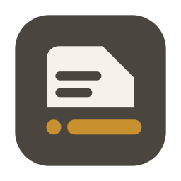
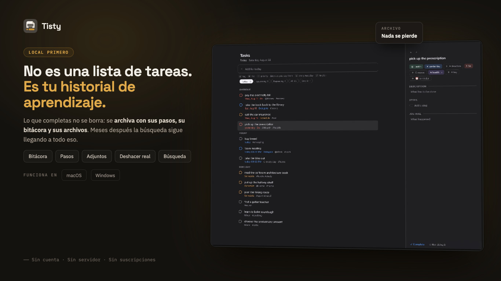
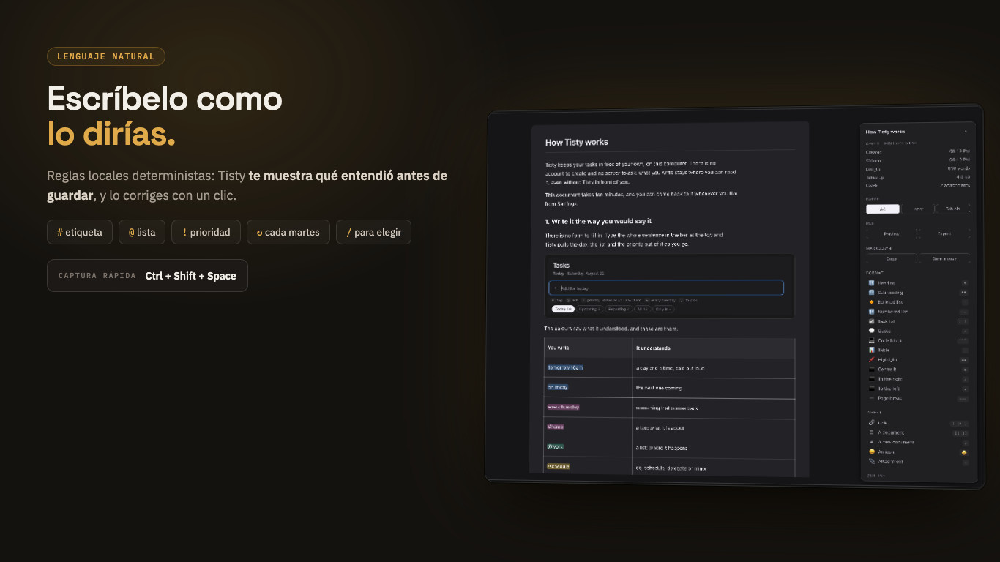
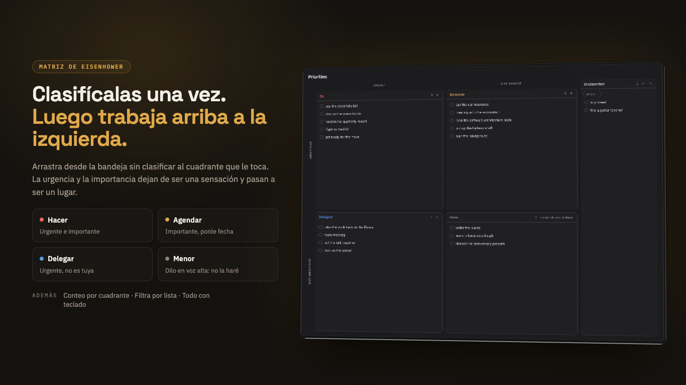
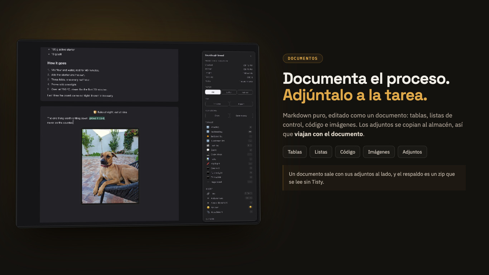
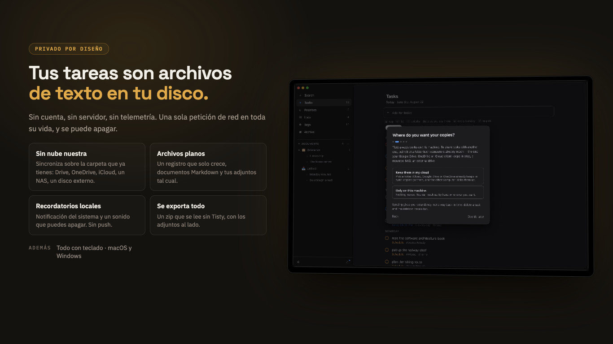

<div align="center">
  

  <h1>Tisty — Notas, documentos y tareas, libres y de código abierto</h1>

  <p><strong>Un histórico local de lo que sabes: notas, documentos y tareas para
  Windows y macOS.<br/>Archivos llanos en tu disco —o en la carpeta de nube que
  tú elijas— con la puerta abierta a tus asistentes. Sin cuentas. Sin
  telemetría. Sin servidor.</strong></p>

  <p>
    <a href="README.md">English</a> ·
    <strong>Español</strong>
  </p>

  <p>
    <a href="https://github.com/rgdevment/Tisty/actions/workflows/ci.yml">
      
    </a>
    <a href="https://sonarcloud.io/summary/overall?id=rgdevment_Tisty">
      
    </a>
    <a href="https://sonarcloud.io/component_measures?id=rgdevment_Tisty&metric=coverage">
      
    </a>
    <a href="https://github.com/rgdevment/Tisty/releases">
      
    </a>
    
    <a href="#licencia">
      
    </a>
  </p>

  <h4>Descargar Tisty</h4>

  <p>
    <a href="https://apps.microsoft.com/detail/9PGVWXD8X93N">
      
    </a>
    <a href="#instalación">
      
    </a>
  </p>

  <p>
    <sub>¿Prefieres la descarga directa?
    <a href="https://github.com/rgdevment/Tisty/releases/latest">GitHub
    Releases</a> lleva los instaladores firmados — Windows (.exe) · macOS
    (.dmg)</sub>
  </p>

  <p>
    <a href="https://buymeacoffee.com/rgdevment">
      
    </a>
  </p>
</div>

---

**Tisty** es un **gestor de tareas** libre y de código abierto para Windows y
macOS, construido sobre una idea: una tarea terminada vale más que el tache que
la cierra. La mayoría de las **aplicaciones de tareas** son una lista que se
tacha — en cuanto completas algo, los pasos que diste, las notas que escribiste
y los documentos en los que te apoyaste se van con ello. Tisty archiva todo eso
en vez de perderlo, y la búsqueda llega a cada palabra.

Esto no es el producto de una empresa. Soy un desarrollador que resolvió dos
veces el mismo problema, así que hice el **gestor de tareas personal** que
quería y lo regalé. Sin anuncios, sin telemetría, sin cuentas, sin
suscripciones — solo una **herramienta de productividad local** que vive en tu
equipo y en ninguna otra parte.

**Por qué alguien elige Tisty antes que otros gestores de tareas:**

- **100% local** — tus tareas, tu bitácora y tus documentos nunca salen de tu
  equipo. Sin nube, sin servidor, sin cuenta. Si sincronizas dos equipos, puedes
  pedirle a Tisty que deje los adjuntos más grandes en esa carpeta compartida en
  vez de llevarlos a cada disco; nunca lo hace si tú no lo eliges.
- **Gratis de verdad** — sin versión de pago, sin funciones bajo llave, sin
  período de prueba. AGPL v3, y [términos comerciales](docs/COMMERCIAL.md) solo
  para organizaciones que no puedan cumplirla.
- **Tus datos duran más que la aplicación** — texto plano y Markdown en tu
  propio disco, que se lee con `cat` y se busca con `grep`.
- **Terminar lo conserva todo** — completar una tarea la manda al archivo con
  sus pasos, sus notas y sus adjuntos intactos, documentos incluidos.
- **Rápido y nativo** — un núcleo en Rust dentro de una ventana Tauri: arranca
  rápido, ocupa poco y parece parte de los dos sistemas.

> Uso Tisty todos los días en macOS y en Windows. Si algo no encaja,
> [abre un issue](https://github.com/rgdevment/Tisty/issues) — este proyecto
> mejora porque alguien lo usa de verdad.
>
> **Es para una persona, a propósito.** Sin responsables, sin permisos, sin
> tableros. Si necesitas llevar un equipo, Tisty no va a sostener eso.



## Contenido

- [Por qué lo hice](#por-qué-lo-hice)
- [Qué es, y qué no es](#qué-es-y-qué-no-es)
- [Qué lo hace distinto](#qué-lo-hace-distinto)
- [Para quién es](#para-quién-es)
- [La idea sobre la que está construido](#la-idea-sobre-la-que-está-construido)
- [Instalación](#instalación)
- [Qué hace](#qué-hace)
- [Tus datos y tu privacidad](#tus-datos-y-tu-privacidad)
- [Dos equipos, si tienes dos](#dos-equipos-si-tienes-dos)
- [Una línea de comandos, si la quieres](#una-línea-de-comandos-si-la-quieres)
- [Un asistente, si usas uno](#un-asistente-si-usas-uno)
- [En qué punto está](#en-qué-punto-está)
- [Qué nunca va a hacer](#qué-nunca-va-a-hacer)
- [Otras herramientas del mismo autor](#otras-herramientas-del-mismo-autor)
- [Sobre hombros ajenos](#sobre-hombros-ajenos)
- [Contribuir](#contribuir)
- [Licencia](#licencia)

## Por qué lo hice

Organizar tu día es más difícil de lo que una lista aparenta. Hay más piezas de
las que caben en la cabeza, los planes se mueven solos, y algo que creías
pequeño resulta que no lo era. Por eso terminarlo se siente bien.

Pero fíjate en lo que esa tarea fue juntando por el camino. Los pasos que de
verdad hubo que dar. Las notas que escribiste mientras lo resolvías. Lo que
consultaste, con qué terminó conectando, los documentos en los que te apoyaste.
Ahí es donde se fue el esfuerzo.

La mía se llamaba *«arreglar los timeouts intermitentes al guardar»*. Cuando
estuvo lista ya llevaba encima el ticket, el commit y dos párrafos explicando
que la causa real era un índice que faltaba en una tabla que nadie miraba.

Ocho meses después pasó lo mismo en otra parte. Me acordaba de haberlo resuelto.
No me acordaba de cómo — y la nota que tenía la respuesta se había ido con el
tache.

**Esa es toda la razón por la que Tisty existe.** Una tarea no es una línea que
se tacha. Es un árbol: los pasos, la bitácora, los archivos y los documentos que
crecieron a su alrededor mientras trabajabas. Terminarla no debería podarlo.

También quería que siguiera siendo mío. En mi disco, en archivos que puedo abrir
sin pedirle permiso a nadie. Así que hice lo que quería tener, lo usé hasta que
dejó de molestarme, y lo dejé acá por si resulta ser lo que tú querías.

## Qué es, y qué no es

**Es** un gestor de tareas personal donde terminar algo es el comienzo de su vida
útil. Las tareas llevan descripción, bitácora, pasos y adjuntos; al completar una
pasa al archivo, y la búsqueda llega a todo, documentos incluidos.

**Es para una persona.** Sin responsables, sin permisos, sin tableros. Si
necesitas llevar un equipo, Tisty no va a sostener eso, y mereces saberlo antes
de instalarlo y no después.

**No es algo que venda.** Nada está bloqueado, nada caduca, y no existe una
versión de esto con más cosas dentro. Es un programa que escribí para mí y
regalé.

**Tus datos son archivos.** Texto plano en tu propio disco, que se lee con `cat`
y se busca con `grep`. Si Tisty desapareciera mañana, todo lo que escribiste
seguiría ahí y seguiría teniendo sentido.

## Qué lo hace distinto

Si buscas un **gestor de tareas libre, de código abierto, sin conexión, sin
cuenta, sin suscripción y sin inteligencia artificial**, esto es Tisty:

| | |
|---|---|
| Tus tareas viven | en archivos de texto, en tu propio disco |
| Cuenta | ninguna, nunca |
| Suscripción | ninguna. No hay plan de pago ni mejora |
| Sin conexión | siempre. No hay servidor del que estar lejos |
| Con IA dentro | **ninguna**, y no la va a llevar |
| Tu propio asistente | sí, por **MCP**, si decides abrir la puerta |
| Prioridades | la **matriz de Eisenhower**, con su nombre |
| Clasificación | listas, etiquetas, pasos y bitácora en cada tarea |
| Documentos | se escriben y se buscan junto a las tareas, no en otra app |
| Adjuntos | se guardan con la tarea, tal como son |
| Lo terminado | un **archivo que conserva lo que cada tarea te enseñó** |
| Dos equipos | por una carpeta que ya sincronizas. Sin servidor nuestro |
| Lenguaje natural | fechas, límites y repeticiones, interpretados en tu equipo |
| Código | abierto, auditable, tuyo para bifurcar |

**La matriz de Eisenhower, no prioridades numeradas.** Una tarea es urgente,
importante, las dos o ninguna — *hacer*, *decidir*, *delegar*, *dejar*. Eso
nombra la decisión en vez de esconderla tras un número, y es la diferencia entre
una lista que ordena y una lista que te ayuda a elegir. Alrededor: listas para
dónde va el trabajo, etiquetas para lo que lo cruza, pasos para las partes, y una
bitácora para lo que aprendes por el camino.

**Terminar es donde empieza.** Casi todos los gestores tratan una tarea cumplida
como basura que esconder. Aquí pasa a un archivo que se lee en tres capas: las
que enseñaron algo vienen con su rastro entero —qué cambió, cuándo, y lo que
escribiste—, las rutinas vienen con sus cuentas y sus rachas, y el resto es la
huella. La búsqueda alcanza todo, documentos incluidos. Al año, ese archivo es la
parte que echarías de menos.

**Tu asistente, no uno nuestro.** Tisty no lleva IA dentro. El lenguaje natural
que convierte "llamar al banco a las 3" en una tarea son reglas corriendo en tu
equipo, sin modelo y sin nube. Pero habla [MCP](https://modelcontextprotocol.io),
así que un asistente que ya uses puede anotar trabajo aquí — con sus pasos, su
fecha y la lista que le toca, en este equipo, sin cuenta y sin nada por la red.
Esa puerta la abres tú, y puedes cerrarla.

**Dos equipos, sin intermediario.** Si ya sincronizas una carpeta, Tisty viaja
por ella. No hay servidor nuestro en medio, no hay que registrarse, y no hay nada
que deje de funcionar el día que una empresa cambie de idea.

**Gratis no es un plan aquí.** No hay mejora de pago, ni cuenta de puestos, ni
función guardada para más adelante. La razón no es generosidad: un programa que
guarda tu trabajo en tu disco y nunca llama a casa no tiene casi nada que cobrar,
y pedirlo lo empeoraría.

## Para quién es

Para alguien que trabaja solo, o casi siempre solo, y cuyas tareas dejan un
rastro que vale la pena guardar. Desarrolladores, administradores de sistemas,
independientes, gente que investiga, quien estudia — cualquiera que haya
resuelto dos veces el mismo problema y lo haya sabido la segunda vez.

Si lo que quieres es una lista para tachar y no volver a abrir, Tisty te va a
parecer más de lo que pediste. Es un motivo razonable para dejarlo pasar.

## La idea sobre la que está construido

**Una tarea completada no está terminada. Está archivada.**

Deja de ser un recordatorio de qué hacer y pasa a ser el registro de cómo se
resolvió algo. De ahí salen tres cosas, y esas moldearon todo lo demás:

- **La búsqueda es la entrada principal al archivo**, no una función lateral.
- **Borrar es la excepción.** El final normal es completar, que conserva. Para
  borrar algo de verdad hacen falta dos pasos deliberados antes: archivarlo y
  luego ocultarlo.
- **Capturar tiene que seguir siendo instantáneo**, porque la mayoría de las
  tareas no son así. La llamada que tienes que hacer mañana nace y muere en un
  día y no deja nada que guardar — y anotarla no puede costar más de una línea.

## Instalación

**Windows** — desde la
[Microsoft Store](https://apps.microsoft.com/detail/9PGVWXD8X93N), que además se
encarga de mantenerla al día.

**macOS** — con [Homebrew](https://brew.sh). El tap se agrega una sola vez y no
se vuelve a tocar. Desde ahí Tisty se mantiene al día sola, y Homebrew se
aparta:

```console
$ brew tap rgdevment/tap
$ brew install --cask tisty
```

O toma la imagen de disco y el instalador directamente de
[Releases](https://github.com/rgdevment/Tisty/releases), en cualquiera de los
dos sistemas.

## Qué hace

**La primera vez que se abre**, Tisty pregunta cuatro cosas —en qué idioma,
dónde quieres tus copias, si puede despertarte para un recordatorio y qué
significa cerrar la ventana— y después te escribe una guía. La guía es un
documento en tu propio almacén, en una carpeta suya: tuya para leerla, editarla
o tirarla como cualquier otra cosa que escribas. Desde ajustes vuelve la
bienvenida, se abre otra vez la guía y se cambia el idioma, que empieza siendo
el de tu sistema.

**Tres columnas como máximo:** qué estás mirando, la lista, y la tarea que
abriste. Nada más en pantalla.

**Lee lo que escribes.** Escribes una frase y Tisty le saca la fecha, deja la
frase legible, y te muestra qué entendió *antes* de guardar nada — como fichas
que corriges con un clic.



```text
"desplegar mañana a las 10"        →  mañana 10:00
"entregar el informe para viernes" →  límite vie
"reservar vuelos @viaje #urgente"  →  @viaje · #urgente
```

Un día, una hora, o las dos. Nombres, distancias, fechas sueltas. Lo que no
puede leer lo deja tal cual en vez de adivinar. Un límite no es lo mismo que un
plan, y lo abren tres palabras: **antes de**, **para** y **hasta**.

**La tarea se abre al lado de la lista**, no encima: fechas, lista, etiquetas,
prioridad, una descripción y una bitácora en Markdown, pasos que vas marcando de
a uno, y lo que le hayas soltado encima. Completarla no aleja nada de eso.

**Las prioridades son una matriz, no una escalera.** Tisty toma los cuatro
cuadrantes de la matriz de Eisenhower — el método que se atribuye al presidente
Dwight D. Eisenhower y que Stephen Covey popularizó en *Los 7 hábitos de la gente
altamente efectiva*: ordena lo que tienes entre urgente e importante, y cada
cuadrante te dice qué hacer con ello. **Hacer** lo urgente e importante,
**Planificar** lo que importa y no corre prisa, **Delegar** lo urgente que no te
toca, y dejar en **Prescindible** aquello de lo que podrías prescindir — cuando
lo tengas claro, un botón lo descarta todo de una vez.

Arrastra una tarea a su cuadrante, o tecléalo: `!hacer`, `!planificar`,
`!delegar`. `!decidir` sigue funcionando, porque así se llamaba antes.
Cada cuadrante lleva un **+** que abre la captura rápida con ese cuadrante ya
puesto, y lo que nadie ha colocado espera en una bandeja que se abre como la
dejaste.



**Los documentos** viven junto a las tareas, para el material de consulta que no
tiene fecha y nunca se tacha. Son archivos Markdown que editas como documentos
—tablas, listas de control, código, imágenes— y la búsqueda también los lee. Una
tarea puede apuntar a un documento; un documento nunca crea tareas.

El texto se puede resaltar en unos cuantos colores, centrar o alinear, y apartar
como un aviso. Sigue siendo Markdown: donde Markdown no alcanza, Tisty escribe
el pedacito de HTML que sí lo dice, y lo vuelve a leer.

Se escribe sobre una hoja iluminada, y su primera línea es a la vez el nombre
del documento y su título. Cuando la ventana da para ello, al lado se abre una
columna con de qué va el documento, el formato que el menú `/` escondía y su
índice. **Tisty genera su propio PDF** —A4, Carta o una hoja sin fin, con sus
propios márgenes y los adjuntos dentro— y te lo enseña antes de exportarlo.



**Un atajo global** abre un campo pequeño encima de lo que estés haciendo, así
una tarea que se te ocurre a mitad de algo no te cuesta ese algo.

**Las tareas que se repiten** vuelven de una en una, así el archivo te muestra
que la hiciste doce veces —y cuenta lo que tocaba, no solo lo que cerraste, de
modo que una rutina se lee 26 de 30 con cuatro fechas sin registro. Si la
marcas días tarde te ofrece esas fechas en vez de darlas por olvidadas: marcas
las que sí hiciste y el hueco se cierra. **Los recordatorios** llegan como
notificación del sistema y un sonido corto que puedes apagar. Toda la ventana
funciona con el teclado.

**El archivo se lee en tres capas.** Las que enseñaron algo vienen con todo su
trayecto: qué cambió, cuándo, y lo que fuiste escribiendo por el camino. Las
rutinas vienen con sus cuentas, sus rachas y la hora a la que sueles cumplirlas.
El resto es el rastro: lo que no dejó nada escrito, en una lista densa y apartada,
porque pasó igual y la búsqueda sigue alcanzándolo.

## Tus datos y tu privacidad



Todo vive en una carpeta de tu disco: un registro de lo que pasó al que solo se
le agrega, tus documentos como archivos `.md`, y tus adjuntos tal como son. Nada
está ofuscado ni en un formato que solo Tisty pueda leer.

**Nada está cifrado en reposo**, y es una decisión, no un descuido: la protección
son los permisos de tu sistema operativo, y así los archivos siguen siendo
legibles con las herramientas que ya tienes. Está explicado en
[PRIVACY.md](PRIVACY.md) y [SECURITY.md](SECURITY.md), incluidas las partes que
no son tranquilizadoras.

Tisty hace **una** petición de red al día sin que se la pidas: mira si existe
una versión más nueva. No envía nada. Si existe y presionas el botón que te la
ofrece, vienen dos más — el archivo que nombra la versión y el instalador — y
Tisty se niega a instalar nada que no esté firmado con una clave compilada
dentro de la copia que ya tienes.

## Dos equipos, si tienes dos

Apunta Tisty a una carpeta que tus dos computadores ya alcancen —la que mantiene
al día tu cliente de Google Drive, OneDrive o iCloud; un NAS; un disco que
enchufas los viernes— y el resto lo hace solo.

No hay nada mío en el medio: ni cuenta, ni servidor, ni proceso residente. Quién
mantenga esa carpeta es asunto tuyo, no de Tisty. Si no sincronizas nada, no abre
una conexión en su vida.

Dos equipos sí pueden escribir el mismo documento a la vez, y ahí Tisty los junta
**bloque a bloque**: editas la introducción en uno, alguien edita el cierre en el
otro, y las dos cosas llegan sin que tengas que responder nada. Solo cuando los
cambios se pisan de verdad hay una pregunta.

**O respalda a mano.** Un zip, guardado donde quieras.

**Dónde viven los grandes lo dices tú.** Por defecto cada equipo carga con todos
los adjuntos, que es por lo que cualquiera de ellos abre lo que sea con la red
apagada. Ajustes ofrece otras dos formas: quedarte solo con lo que adjuntaste en
este equipo y traer el resto cuando lo abras, o —por encima de 50 MB— dejarlos
en la carpeta compartida y en ningún otro sitio. Esa última cambia la copia de
tu disco por el espacio que ocupaba: el archivo está cuando está tu nube o tu
NAS, y
Tisty te lo dice con todas las letras cuando no. Una copia solo se suelta después
de comprobar que la de la carpeta compartida tiene el mismo sha.

Y como quien sube esa carpeta es el programa de tu proveedor y no Tisty, si algún
día cambias algo en un equipo y no aparece en el otro, [FAQ.md](docs/FAQ.md)
enumera las causas en el orden en que conviene revisarlas (en inglés).

## Una línea de comandos, si la quieres

La ventana es la entrada principal. Pero todo lo que hace ella lo hace también la
terminal: el mismo almacén, las mismas tareas, el mismo lenguaje natural. Existe
porque yo la quería, y es totalmente opcional.

```console
$ tisty "llamar al banco a las 3"
$ tisty ls hoy
$ tisty done 2
```

Ajustes la deja al alcance de tu terminal, o puedes instalar solo el comando con
`brew install rgdevment/tap/tisty-cli` y no abrir nunca la ventana.

## Un asistente, si usas uno

**Tisty no es inteligencia artificial ni la lleva dentro.** El lenguaje natural
que convierte "llamar al banco a las 3" en una tarea es un puñado de reglas
corriendo en tu equipo: sin modelo, sin petición, sin nube. Eso no va a cambiar.

Pero si ya usas un asistente, es probable que le cuentes cosas que vale la pena
guardar — el grupo del colegio pide cartulina para el lunes, la cuenta vence el
30. Así que Tisty deja una puerta, y tú decides si la usas.

Ajustes › Agentes enumera los asistentes que ya tienes instalados en este
equipo y conecta el que elijas: escribe una sola línea en la configuración de
ese asistente, deja el resto de ese archivo donde estaba y guarda al lado una
copia de cómo era. Para uno que no conozca, basta una línea:

```console
$ <tu-asistente> mcp add tisty -- tisty mcp
```

Donde `<tu-asistente>` es como se llame el tuyo. Habla
[MCP](https://modelcontextprotocol.io) dentro del mismo equipo: sin
cuenta, sin token, nada por la red. **Quien la abre eres tú.** El asistente
aparece en Ajustes › Agentes como un dispositivo al que tienes que dar entrada,
y sigue siendo un dispositivo que puedes echar; mientras no le des entrada, todo
lo que intente se le niega.

Lo que puede hacer es deliberadamente poco: anotar una tarea con sus pasos y su
fecha, agregar a la bitácora, escribir un documento, agregar al final de uno que
ya está ahí, corregir un pasaje de uno, ordenar documentos en carpetas, guardar
una copia de un archivo que le señales —en una tarea o dentro de un documento,
que admite el archivo más grande de los dos— y leer lo que ya está. Lo que no
puede: cerrar una tarea ni borrarla, borrar un documento ni entregarle un cuerpo
nuevo entero, renombrar ni vaciar una carpeta, alcanzar una tarea que plegaste,
tomar archivos fuera de las carpetas donde aterriza una descarga, ni anotar dos
veces lo mismo. Para corregir un pasaje tiene que nombrarlo tal como lo
escribiste, y si ese texto no está o está dos veces, no se escribe nada. Un
documento que archivaste sí lo puede leer, y se le dice que lo archivaste.

Lo que lea viaja adonde viaje ese asistente. Eso queda entre él y tú — que es
justamente por lo que esta es una puerta que abres, y no una que ya estaba
abierta.

## En qué punto está

| | |
|---|---|
| ✅ | Tareas, listas, etiquetas, pasos, bitácora, adjuntos, búsqueda |
| ✅ | Un archivo que se lee en tres capas, con lo que dejó cada tarea |
| ✅ | Lenguaje natural para fechas, límites y repeticiones |
| ✅ | La ventana, la bandeja, y captura rápida con un atajo global |
| ✅ | Documentos: editor, carpetas, y transporte que junta bloque a bloque |
| ✅ | Un asistente puede anotar por ti, por MCP, si lo dejas entrar |
| ✅ | Recordatorios, respaldo, y sincronización por una carpeta compartida |
| ✅ | Bienvenida guiada, una guía escrita en tu almacén, español e inglés |
| ✅ | macOS: firmado y notarizado. Windows: instalador firmado |
| ◐ | Uso diario, que es lo que saca los fallos que los tests no — para eso es la candidata |
| ◐ | La ficha de la Microsoft Store, cuyas capturas hay que rehacer en Windows |

Dos cosas están asumidas en vez de pendientes: no se puede reordenar a mano en la
ventana —el arrastre de HTML no sobrevive al de archivos nativo que necesitan los
adjuntos, y los adjuntos eran el mejor trato— y nada se ha probado con un lector
de pantalla real, aunque el camino por teclado sí.

## Qué nunca va a hacer

Tan importante como la lista de arriba. Fuera de alcance para siempre: trabajo
colaborativo en tiempo real, tableros kanban, diagramas de Gantt, control de
horas, métricas de productividad, bases de datos con propiedades tipadas y
fórmulas, e inteligencia artificial en cualquier punto del camino crítico.

El lenguaje natural se queda determinista y local, y **Tisty nunca envía nada a
un modelo** — ni una tarea, ni una palabra. Si abres la puerta de la sección de
arriba, lo que tu asistente lea viaja adonde viaje ese asistente: Tisty sigue
sin enviar nada, quien lleva es el asistente, y quien lo dejó entrar eres tú.

## Otras herramientas del mismo autor

Misma idea, mismos términos: gratis, código abierto, sin anuncios, sin
telemetría, todo local.

- **[CopyPaste](https://github.com/rgdevment/CopyPaste)** — un gestor de
  portapapeles para Windows, macOS y Linux.
- **[LinkUnbound](https://github.com/rgdevment/LinkUnbound)** — un selector de
  navegadores para Windows y macOS: pregunta cuál debe abrir un enlace en vez de
  suponerlo.

## Sobre hombros ajenos

Tisty es pequeño porque el trabajo pesado lo hace la gente que escribió esto.

**El núcleo, en Rust** — [Tauri](https://tauri.app) le pone una ventana nativa
sin cargar con un navegador; [serde](https://serde.rs) lee y escribe cada línea
del registro; [jiff](https://github.com/BurntSushi/jiff) hace las fechas y las
zonas horarias, que es la parte que nadie debería escribir dos veces;
[SQLite](https://sqlite.org), a través de
[rusqlite](https://github.com/rusqlite/rusqlite), guarda la caché de lectura;
[clap](https://github.com/clap-rs/clap) es la línea de comandos;
[ULID](https://github.com/dylanhart/ulid-rs) le da a cada tarea un identificador
que ordena por tiempo y no necesita coordinación.

**La ventana** — [React](https://react.dev) la dibuja y
[Tailwind CSS](https://tailwindcss.com) la viste;
[TipTap](https://tiptap.dev) y [ProseMirror](https://prosemirror.net) son el
editor de documentos; [markdown-it](https://github.com/markdown-it/markdown-it)
compone la prosa del resto; [Vite](https://vite.dev) la construye y
[Vitest](https://vitest.dev) la prueba.

La lista completa, con versiones y licencias, está en `Cargo.lock` y
`app/package-lock.json`.

## Contribuir

Cómo funcionan de verdad el almacén, la fusión y el transporte está escrito en
[ARCHITECTURE.md](docs/ARCHITECTURE.md) — una referencia del comportamiento,
no un paseo por el código. Está en inglés, como el resto de `docs/`.

Lee [CONTRIBUTING.md](CONTRIBUTING.md). Abre un issue antes de escribir código
para cualquier cosa que no sea un arreglo: Tisty es deliberadamente mínimo, y una
función bien escrita se puede rechazar igual — normalmente porque convertiría la
herramienta en otra cosa.

## Licencia

[AGPL-3.0](LICENSE), y disponible bajo
[términos comerciales](docs/COMMERCIAL.md) para organizaciones que no puedan
cumplirla.

Las compilaciones firmadas de las tiendas llevan sus propios términos, porque las
tiendas no aceptan la AGPL — [DISTRIBUTION.md](docs/DISTRIBUTION.md) dice
cuál aplica a lo que tengas, y por qué. En ningún caso se retiene nada del código.
