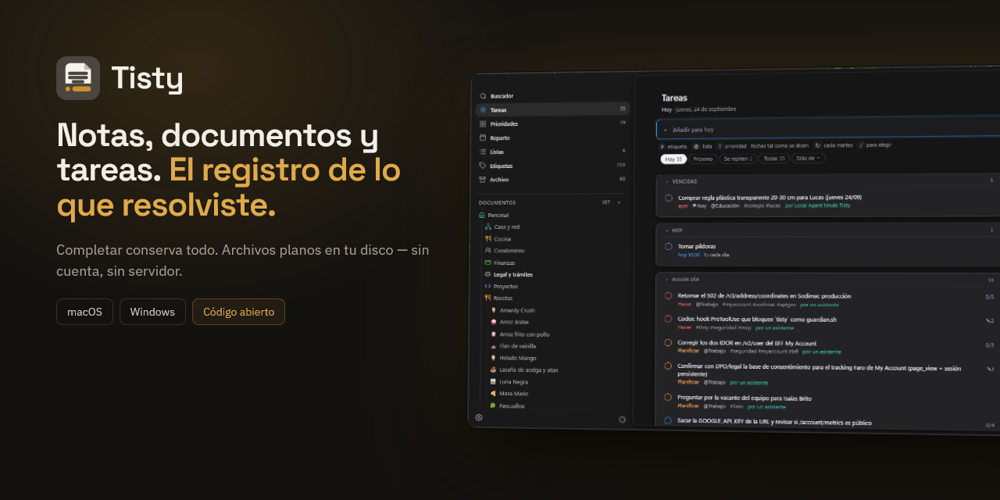
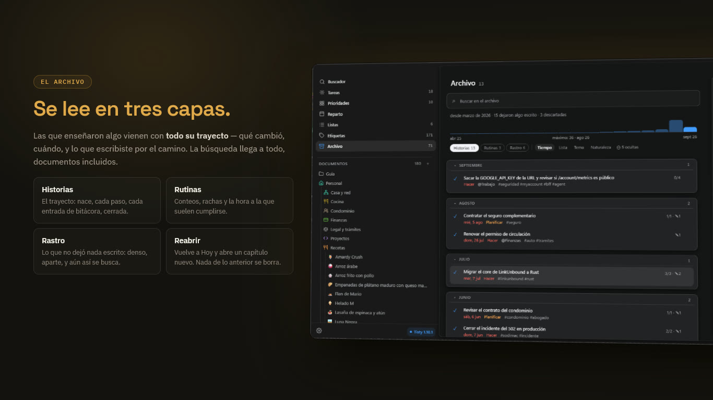
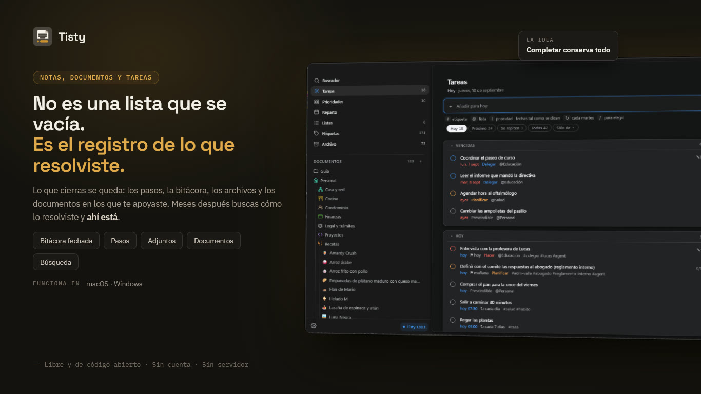
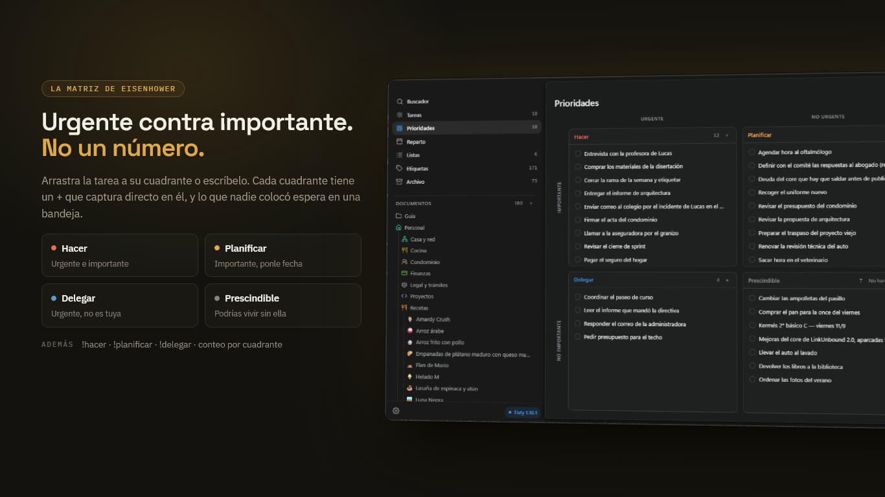
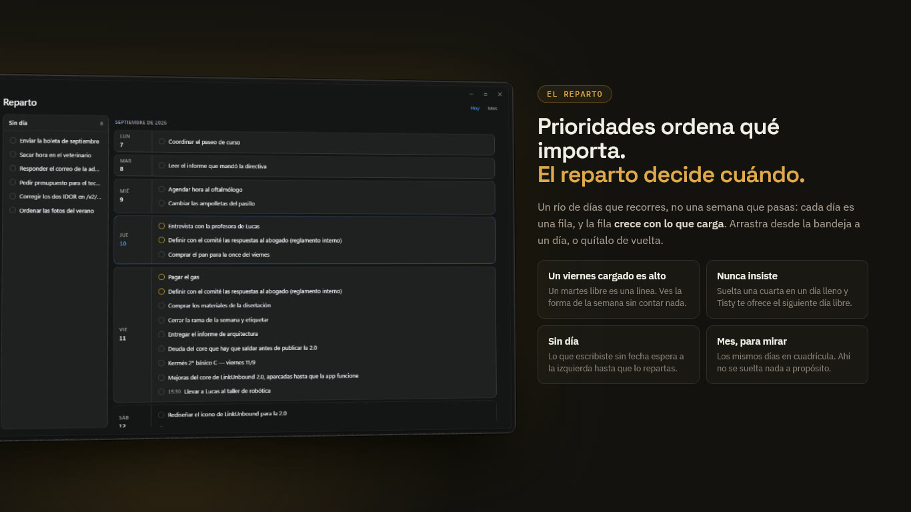
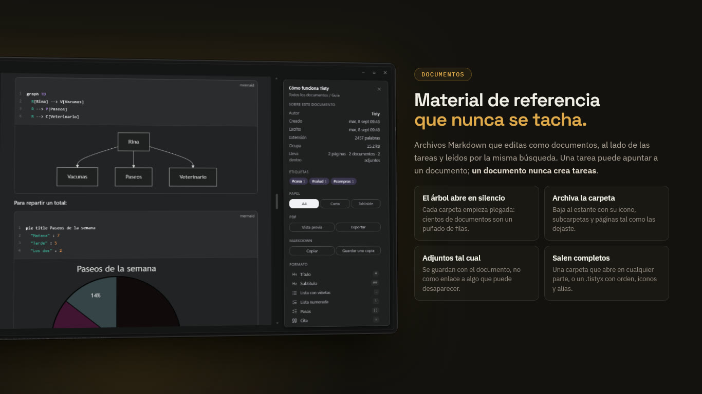
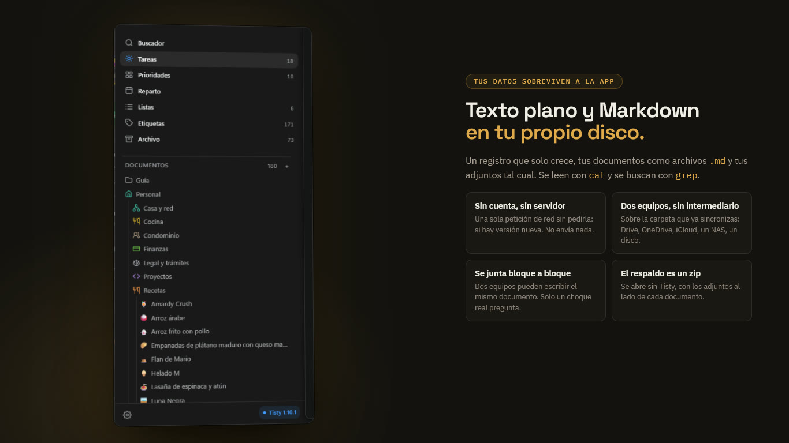

<div align="center">
  

  <h1>Tisty — Notas, documentos y tareas, libres y de código abierto</h1>

  <p><strong>Notas, documentos y tareas que siguen siendo tuyos: Markdown llano
  en tu disco, para Windows y macOS.<br/>No es una lista que se vacía, es el
  historial de cómo resolviste las cosas, buscable años después, con una puerta
  MCP para tu asistente.<br/>Sin cuentas. Sin suscripciones. Sin telemetría. Sin
  servidor.</strong></p>

  <p>
    <a href="README.md">English</a> ·
    <strong>Español</strong>
  </p>

  <p>
    <a href="https://github.com/rgdevment/Tisty/releases">
      
    </a>
    <a href="#un-asistente-si-usas-uno">
      
    </a>
    
    <a href="#licencia">
      
    </a>
    <a href="https://github.com/sponsors/rgdevment">
      
    </a>
    <a href="https://buymeacoffee.com/rgdevment">
      
    </a>
  </p>

  <p>
    
  </p>

  <h4>Descargar Tisty</h4>

  <p>
    <a href="https://apps.microsoft.com/detail/9PGVWXD8X93N">
      
    </a>
    <a href="#instalación">
      
    </a>
  </p>

  <p>
    <sub>¿Prefieres la descarga directa?
    <a href="https://github.com/rgdevment/Tisty/releases/latest">GitHub
    Releases</a> lleva los instaladores firmados — Windows (.exe) · macOS
    (.dmg, uno por chip)</sub>
  </p>

</div>

---

**Tisty** es Opensource. Puedes leerlo, compilarlo, probarlo o descargar las
versiones estables que ya están publicadas. No hay nada oculto: todo es
auditable.

No es una **aplicación de tareas** como la conoces. Una lista se vacía y se
olvida. Aquí lo que cierras se queda: lo que hiciste, cuándo, y lo que fuiste
averiguando por el camino. Meses después buscas cómo resolviste algo y está ahí:
la descripción, el diario, los pasos y los documentos en los que te apoyaste.

No soy una empresa. Soy un desarrollador que resolvió dos veces el mismo
problema, así que hice el **gestor de notas, documentos y tareas** que quería y
lo regalé. Quiero que siga siendo pequeño y útil, no que crezca con mil funciones
que nadie usa. Sin anuncios, sin telemetría, sin cuentas, sin suscripciones: una
**herramienta local** que vive en tu equipo y en ninguna otra parte.

**Por qué alguien elige Tisty antes que otros gestores de tareas:**

- **100% local** — tus tareas, tu bitácora y tus documentos nunca salen de tu
  equipo. Sin nube, sin servidor, sin cuenta. Si sincronizas dos equipos, puedes
  pedirle a Tisty que deje los adjuntos más grandes en esa carpeta compartida en
  vez de llevarlos a cada disco; nunca lo hace si tú no lo eliges.
- **Gratis de verdad** — sin versión de pago, sin funciones bajo llave, sin
  período de prueba. AGPL v3, y [términos comerciales](docs/COMMERCIAL.md) solo
  para organizaciones que no puedan cumplirla.
- **Tus datos duran más que la aplicación** — texto plano y Markdown en tu
  propio disco, que se lee con `cat` y se busca con `grep`.
- **Terminar lo conserva todo** — completar una tarea la manda al archivo con
  sus pasos, sus notas y sus adjuntos intactos, documentos incluidos.
- **Rápido y nativo** — un núcleo en Rust dentro de una ventana Tauri: arranca
  rápido, ocupa poco y parece parte de los dos sistemas.

> Uso Tisty todos los días en macOS y en Windows. Si algo no encaja,
> [abre un issue](https://github.com/rgdevment/Tisty/issues) — este proyecto
> mejora porque alguien lo usa de verdad.
>
> **Es para una persona, a propósito.** Sin responsables, sin permisos, sin
> tableros. Si necesitas llevar un equipo, Tisty no va a sostener eso.



## Contenido

- [Por qué lo hice](#por-qué-lo-hice)
- [Qué es, y qué no es](#qué-es-y-qué-no-es)
- [Qué lo hace distinto](#qué-lo-hace-distinto)
- [Para quién es](#para-quién-es)
- [La idea sobre la que está construido](#la-idea-sobre-la-que-está-construido)
- [Instalación](#instalación)
- [Qué hace](#qué-hace)
- [Tus datos y tu privacidad](#tus-datos-y-tu-privacidad)
- [Dos equipos, si tienes dos](#dos-equipos-si-tienes-dos)
- [Una línea de comandos, si la quieres](#una-línea-de-comandos-si-la-quieres)
- [Un asistente, si usas uno](#un-asistente-si-usas-uno)
- [Qué nunca va a hacer](#qué-nunca-va-a-hacer)
- [Preguntas frecuentes](#preguntas-frecuentes)
- [Alternativas](#alternativas)
- [Idiomas](#idiomas)
- [Otras herramientas del mismo autor](#otras-herramientas-del-mismo-autor)
- [Apoyar el proyecto](#apoyar-el-proyecto)
- [Sobre hombros ajenos](#sobre-hombros-ajenos)
- [Contribuir](#contribuir)
- [Licencia](#licencia)
- [Salud del proyecto](#salud-del-proyecto)

## Por qué lo hice

Organizar tu día es más difícil de lo que una lista aparenta. Hay más piezas de
las que caben en la cabeza, los planes se mueven solos, y algo que creías
pequeño resulta que no lo era. Por eso terminarlo se siente bien.

Pero fíjate en lo que esa tarea fue juntando por el camino. Los pasos que de
verdad hubo que dar. Las notas que escribiste mientras lo resolvías. Lo que
consultaste, con qué terminó conectando, los documentos en los que te apoyaste.
Ahí es donde se fue el esfuerzo.

La mía se llamaba *«arreglar los timeouts intermitentes al guardar»*. Cuando
estuvo lista ya llevaba encima el ticket, el commit y dos párrafos explicando
que la causa real era un índice que faltaba en una tabla que nadie miraba.

Ocho meses después pasó lo mismo en otra parte. Me acordaba de haberlo resuelto.
No me acordaba de cómo — y la nota que tenía la respuesta se había ido con el
tache.

**Esa es toda la razón por la que Tisty existe.** Una tarea no es una línea que
se tacha. Es un árbol: los pasos, la bitácora, los archivos y los documentos que
crecieron a su alrededor mientras trabajabas. Terminarla no debería podarlo.

También quería que siguiera siendo mío. En mi disco, en archivos que puedo abrir
sin pedirle permiso a nadie. Así que hice lo que quería tener, lo usé hasta que
dejó de molestarme, y lo dejé acá por si resulta ser lo que tú querías.

## Qué es, y qué no es

**Es** un gestor de tareas personal donde terminar algo es el comienzo de su vida
útil. Las tareas llevan descripción, bitácora, pasos y adjuntos; al completar una
pasa al archivo, y la búsqueda llega a todo, documentos incluidos.

**Es para una persona.** Sin responsables, sin permisos, sin tableros. Si
necesitas llevar un equipo, Tisty no va a sostener eso, y mereces saberlo antes
de instalarlo y no después.

**No es algo que venda.** Nada está bloqueado, nada caduca, y no existe una
versión de esto con más cosas dentro. Es un programa que escribí para mí y
regalé.

**Tus datos son archivos.** Texto plano en tu propio disco, que se lee con `cat`
y se busca con `grep`. Si Tisty desapareciera mañana, todo lo que escribiste
seguiría ahí y seguiría teniendo sentido.

## Qué lo hace distinto

Si buscas un **gestor de tareas libre, de código abierto, sin conexión, sin
cuenta, sin suscripción y sin inteligencia artificial**, esto es Tisty:

| | |
|---|---|
| Tus tareas viven | en archivos de texto, en tu propio disco |
| Cuenta | ninguna, nunca |
| Suscripción | ninguna. No hay plan de pago ni mejora |
| Sin conexión | siempre. No hay servidor del que estar lejos |
| Con IA dentro | **ninguna**, y no la va a llevar |
| Tu propio asistente | sí, por **MCP**, si decides abrir la puerta |
| Prioridades | la **matriz de Eisenhower**, con su nombre |
| Clasificación | listas, etiquetas, pasos y bitácora en cada tarea |
| Documentos | se escriben y se buscan junto a las tareas, no en otra app |
| Adjuntos | se guardan con la tarea, tal como son |
| Lo terminado | un **archivo que conserva lo que cada tarea te enseñó** |
| Dos equipos | por una carpeta que ya sincronizas. Sin servidor nuestro |
| Lenguaje natural | fechas, límites y repeticiones, interpretados en tu equipo |
| Cuándo hacerlo | un reparto de días donde repartes el trabajo, y un mes para mirar |
| Recordatorios | una hora que eliges, que suena en este equipo y en ningún otro |
| Código | abierto, auditable, tuyo para bifurcar |

**La matriz de Eisenhower, no prioridades numeradas.** Una tarea es urgente,
importante, las dos o ninguna — *hacer*, *decidir*, *delegar*, *dejar*. Eso
nombra la decisión en vez de esconderla tras un número, y es la diferencia entre
una lista que ordena y una lista que te ayuda a elegir. Alrededor: listas para
dónde va el trabajo, etiquetas para lo que lo cruza, pasos para las partes, y una
bitácora para lo que aprendes por el camino.

**Terminar es donde empieza.** Casi todos los gestores tratan una tarea cumplida
como basura que esconder. Aquí pasa a un archivo que se lee en tres capas: las
que enseñaron algo vienen con su rastro entero —qué cambió, cuándo, y lo que
escribiste—, las rutinas vienen con sus cuentas y sus rachas, y el resto es la
huella. La búsqueda alcanza todo, documentos incluidos. Al año, ese archivo es la
parte que echarías de menos.

**Tu asistente, no uno nuestro.** Tisty no lleva IA dentro. El lenguaje natural
que convierte "llamar al banco a las 3" en una tarea son reglas corriendo en tu
equipo, sin modelo y sin nube. Pero habla [MCP](https://modelcontextprotocol.io),
así que un asistente que ya uses puede anotar trabajo aquí — con sus pasos, su
fecha y la lista que le toca, en este equipo, sin cuenta y sin nada por la red.
Esa puerta la abres tú, y puedes cerrarla.

**Dos equipos, sin intermediario.** Si ya sincronizas una carpeta, Tisty viaja
por ella. No hay servidor nuestro en medio, no hay que registrarse, y no hay nada
que deje de funcionar el día que una empresa cambie de idea.

**Gratis no es un plan aquí.** No hay mejora de pago, ni cuenta de puestos, ni
función guardada para más adelante. La razón no es generosidad: un programa que
guarda tu trabajo en tu disco y nunca llama a casa no tiene casi nada que cobrar,
y pedirlo lo empeoraría.

## Para quién es

Para alguien que trabaja solo, o casi siempre solo, y cuyas tareas dejan un
rastro que vale la pena guardar. Desarrolladores, administradores de sistemas,
independientes, gente que investiga, quien estudia — cualquiera que haya
resuelto dos veces el mismo problema y lo haya sabido la segunda vez.

Si lo que quieres es una lista para tachar y no volver a abrir, Tisty te va a
parecer más de lo que pediste. Es un motivo razonable para dejarlo pasar.

## La idea sobre la que está construido

**Una tarea completada no está terminada. Está archivada.**

Deja de ser un recordatorio de qué hacer y pasa a ser el registro de cómo se
resolvió algo. De ahí salen tres cosas, y esas moldearon todo lo demás:

- **La búsqueda es la entrada principal al archivo**, no una función lateral.
- **Borrar es la excepción.** El final normal es completar, que conserva. Solo
  se borra de verdad lo que está cerrado y se lee como rastro; una historia solo
  se oculta, y convertirla en rastro es el paso deliberado que la deja ir.
- **Capturar tiene que seguir siendo instantáneo**, porque la mayoría de las
  tareas no son así. La llamada que tienes que hacer mañana nace y muere en un
  día y no deja nada que guardar — y anotarla no puede costar más de una línea.

## Instalación

**Windows** — desde la
[Microsoft Store](https://apps.microsoft.com/detail/9PGVWXD8X93N), que además se
encarga de mantenerla al día. Si prefieres no esperar, Acerca de se la pide en
el momento. O con el gestor de paquetes de Windows, que toma el instalador
firmado de la página de releases y después se aparta, porque Tisty se mantiene
al día sola:

```console
> winget install rgdevment.Tisty
```

**macOS** — con [Homebrew](https://brew.sh). El tap se agrega una sola vez y no
se vuelve a tocar. Desde ahí Tisty se mantiene al día sola, y Homebrew se
aparta:

```console
$ brew tap rgdevment/tap
$ brew install --cask tisty
```

O toma la imagen de disco y el instalador directamente de
[Releases](https://github.com/rgdevment/Tisty/releases), en cualquiera de los
dos sistemas. En macOS hay dos imágenes: `aarch64` para Apple Silicon y
`x86_64` para Intel — menú Apple › *Acerca de este Mac* dice cuál es la tuya.
Homebrew elige sola.

## Qué hace

**La primera vez que se abre**, Tisty pregunta dos cosas —en qué idioma y dónde
quieres tus copias— y después te escribe una guía y te la abre. Lo demás lo
decide por ti y lo puedes cambiar luego: arranca con el equipo y espera
apartado, porque eran preguntas con una respuesta evidente. La guía es un
documento en tu propio almacén, en una carpeta suya: tuya para leerla, editarla
o tirarla como cualquier otra cosa que escribas.

**La configuración responde cuatro preguntas en vez de llevar cinco etiquetas.**
*General* es cómo se porta Tisty contigo: idioma, arranque, captura rápida,
avisos, actualizaciones, y las dos cosas que ocurren fuera de la ventana —la
línea de comandos y la bienvenida—. *Tus datos* es todo lo que toca tus
archivos, con la sincronización como bloque propio porque tiene estado, un aviso
que depende de quién guarde tu carpeta y cuatro acciones. *Asistentes* y
*Mantenimiento* son lo que dicen.

**Tres columnas como máximo:** qué estás mirando, la lista, y la tarea que
abriste. Nada más en pantalla.

**La lista se queda donde está.** No se va al centro de lo que sobra, así que
abrir una tarea no mueve nada. Cuando la ventana da de sí, el sitio que se abre
no se queda en blanco: una columna te cuenta el día —lo vencido, lo de hoy, lo
que viene, los cuatro cuadrantes con sus cuentas, las listas con algo abierto y
las etiquetas en uso—. Todo eso cuenta tu almacén entero, no lo que hay en
pantalla, y cada cifra es una puerta. Estrecha la ventana y se aparta: una tarea
siempre le gana el sitio.

**Lee lo que escribes.** Escribes una frase y Tisty le saca la fecha, deja la
frase legible, y te muestra qué entendió *antes* de guardar nada — como fichas
que corriges con un clic.



```text
"desplegar mañana a las 10"        →  mañana 10:00
"entregar el informe para viernes" →  límite vie
"reservar vuelos @viaje #urgente"  →  @viaje · #urgente
```

Un día, una hora, o las dos. Nombres, distancias, fechas sueltas. Lo que no
puede leer lo deja tal cual en vez de adivinar. Un límite no es lo mismo que un
plan, y lo abren tres palabras: **antes de**, **para** y **hasta**.

**La tarea se abre al lado de la lista**, no encima: fechas, lista, etiquetas,
prioridad, una descripción y una bitácora en Markdown, pasos que vas marcando de
a uno, y lo que le hayas soltado encima. Completarla no aleja nada de eso.
Abierta a toda la página gana una columna con su propio trayecto: cuántos días
lleva abierta, cuánto va hecho y cada cambio por el que ha pasado, que hasta
ahora vivía al final, donde nadie bajaba.

**Las prioridades son una matriz, no una escalera.** Tisty toma los cuatro
cuadrantes de la matriz de Eisenhower — el método que se atribuye al presidente
Dwight D. Eisenhower y que Stephen Covey popularizó en *Los 7 hábitos de la gente
altamente efectiva*: ordena lo que tienes entre urgente e importante, y cada
cuadrante te dice qué hacer con ello. **Hacer** lo urgente e importante,
**Planificar** lo que importa y no corre prisa, **Delegar** lo urgente que no te
toca, y dejar en **Prescindible** aquello de lo que podrías prescindir — cuando
lo tengas claro, un botón lo descarta todo de una vez.

Arrastra una tarea a su cuadrante, o tecléalo: `!hacer`, `!planificar`,
`!delegar`. `!decidir` sigue funcionando, porque así se llamaba antes.
Cada cuadrante lleva un **+** que abre la captura rápida con ese cuadrante ya
puesto, y lo que nadie ha colocado espera en una bandeja que se abre como la
dejaste.



**El reparto reparte tus días, una fila cada vez.** Las prioridades ordenan lo
que importa; el reparto decide cuándo. Es un río de días por el que bajas, no
una semana que pasas de página: cada día es una fila, y la fila crece con lo que
lleva, así que un viernes cargado es alto y un martes libre es una línea. Lo que
escribiste sin día espera en una bandeja a la izquierda, y lo arrastras hasta un
día —o lo devuelves a la bandeja para quitarle el día otra vez—. Si lo sueltas
en un día que ya lleva tres, Tisty te lo dice y te ofrece el siguiente que está
libre; nunca insiste.

Un botón de **mes** está para mirar, no para repartir: lo pulsas y esos mismos
días se ordenan en cuadrícula, pulsas un día y caes en él dentro del río. Ahí no
se suelta nada, a propósito. Tisty no ve el calendario que llevas en otro sitio,
así que una casilla sin nada escrito es solo una casilla sin nada escrito, nunca
la promesa de que ese día es tuyo.



**Los documentos** viven junto a las tareas, para el material de consulta que no
tiene fecha y nunca se tacha. Son archivos Markdown que editas como documentos
—tablas, listas de control, código, imágenes— y la búsqueda también los lee. Una
tarea puede apuntar a un documento; un documento nunca crea tareas.

**El árbol abre en silencio y se guarda entero.** Cada carpeta nace plegada, así
que un almacén con cientos de documentos son cuatro filas hasta que vas a
buscar. Cuando un trabajo termina archivas la carpeta, no sus documentos uno a
uno: baja al estante del final del árbol con su icono, sus subcarpetas y sus
páginas tal como las dejaste, cerrada a escribir y a que entre nada nuevo.
Desarchívala y vuelve igual —incluidos los documentos que hubieras archivado a
mano ahí dentro, que siguen archivados porque nadie dijo lo contrario.

**Una página se archiva sola sin salir de su documento.** Algo largo por partes
—un año de actas, un libro por capítulos— es un documento con páginas, y el
capítulo que ya no aplica se va al archivo donde vive: atenuado, con el icono
del archivo, se lee pero no se escribe. Archiva el documento entero y se guardan
todas con él; desarchívalo y cada una vuelve como estaba, y la que habías
apartado sigue apartada.

**Un documento se etiqueta como una tarea**: escribes `#contrato` en mitad de
una frase y el documento queda archivado bajo ella. La etiqueta vive en la
frase, no en una cabecera oculta, así que llevarte el archivo a otro editor se
lleva la etiqueta contigo. Etiquetas es donde se encuentran: una pantalla, las
tareas de una etiqueta y debajo los documentos, y presionar una etiqueta
dentro de un documento abre justo eso. Los acentos se pliegan y las mayúsculas también,
así que `#camion` y `#camión` son una sola palabra la escribas como la
escribas. Un número suelto no es una etiqueta —`#1234` es el ticket que
alguien anotó, no un tema— y una sola letra tampoco: hacen falta dos
caracteres y que alguno sea una letra.

El texto se puede resaltar en unos cuantos colores y apartar como un aviso: una
cita normal, o un callout que GitHub también lee, escrito `> [!WARNING]`. Las
tablas conservan hacia dónde se inclinan sus columnas y con qué ancho las
dibujaste, y un bloque de código dice de qué lenguaje es y se colorea para él,
con sus líneas numeradas al lado del texto y no dentro, así copiar se lleva el
código y nada más. Un bloque puede llevar nombre; el que dice `mermaid` dibuja
debajo el diagrama que describe —y lo redibuja al cambiar de luz—, y el que dice
`math` compone la fórmula que guarda.

**Un enlace solo en su línea se dibuja como tarjeta**, hecha con la dirección
misma: el nombre del sitio y las palabras que escribiste. No se descarga nada
para dibujarla. Presiona **Traer la vista previa** y Tisty le pide a esa
página una sola vez su título, su descripción y la imagen que ofrezca, guarda
la respuesta
aquí para no volver a preguntar, y no lee más de lo que necesita: una página no
decide cuánto de tu equipo ocupa.

**Sigue siendo Markdown**, y eso es lo importante, no un detalle: todo lo de
arriba es sintaxis que otro lector ya entiende, así que el archivo sobrevive sin
Tisty —el nombre de un bloque es lo que Markdown guarda tras el lenguaje, y el
ancho de una columna viaja en lo largo que se dibuje su raya, que cualquier otro
lector ignora y pinta igual—. Donde Markdown de verdad no alcanza, Tisty escribe
el pedacito de HTML que sí lo dice, y lo vuelve a leer.

Se escribe sobre una hoja iluminada, y su primera línea es a la vez el nombre
del documento y su título. Cuando la ventana da para ello, al lado se abre una
columna con de qué va el documento, el formato que el menú `/` escondía y su
índice. **Tisty genera su propio PDF** —A4, Carta o una hoja sin fin, con sus
propios márgenes y los adjuntos dentro— y te lo enseña antes de exportarlo.

**Y salen enteros.** Un documento se copia como Markdown, se escribe en una
carpeta con sus páginas y sus adjuntos al lado, o se exporta para Tisty en un
archivo `.tistyx` que además guarda lo que el Markdown no sabe decir: las
carpetas con su orden, su icono y su color, de qué documento cuelga cada
página, qué está archivado y con qué alias se firmó. Lleva también un
`README.txt`, para que quien lo reciba pueda leer los documentos sin Tisty y
sepa dónde encontrarlo si quiere lo demás. Al exportarlos todos te
pregunta para quién son: abiertos, para dárselos a alguien, o cerrados con seis
dígitos para otro equipo tuyo —que es lo que hace que allí lleguen como tuyos y
no como de un desconocido—. En cualquiera de los dos casos, dentro no viaja ni
una línea del historial. Si escribes un alias —opcional, y solo tú decides
cuál—, cada documento queda firmado con él, y lo que te llegue de otra persona
conserva el suyo.



**Un atajo global** abre un campo pequeño encima de lo que estés haciendo, así
una tarea que se te ocurre a mitad de algo no te cuesta ese algo.

**Las tareas que se repiten** vuelven de una en una, así el archivo te muestra
que la hiciste doce veces —y cuenta lo que tocaba, no solo lo que cerraste, de
modo que una rutina se lee 26 de 30 con cuatro fechas sin registro. Si la
marcas días tarde te ofrece esas fechas en vez de darlas por olvidadas: marcas
las que sí hiciste y el hueco se cierra. **Los recordatorios** llegan como
notificación del sistema y un sonido corto que puedes apagar. Toda la ventana
funciona con el teclado.

**El archivo se lee en tres capas.** Las que enseñaron algo vienen con todo su
trayecto: qué cambió, cuándo, y lo que fuiste escribiendo por el camino. Las
rutinas vienen con sus cuentas, sus rachas y la hora a la que sueles cumplirlas.
El resto es el rastro: lo que no dejó nada escrito, o casi nada, en una lista
densa y apartada, porque pasó igual y la búsqueda sigue alcanzándolo. Tú decides
en qué capa se lee cada una: una historia que era ruido pasa al rastro, y un
rastro que vale la pena se guarda como historia. El rastro es la única capa que
se puede borrar, y tanto borrar como ocultar van de una en una; una historia solo
se oculta.

## Tus datos y tu privacidad



Todo vive en una carpeta de tu disco: un registro de lo que pasó al que solo se
le agrega, tus documentos como archivos `.md`, y tus adjuntos tal como son. Nada
está ofuscado ni en un formato que solo Tisty pueda leer.

**Nada está cifrado en reposo**, y es una decisión, no un descuido: la protección
son los permisos de tu sistema operativo, y así los archivos siguen siendo
legibles con las herramientas que ya tienes. Está explicado en
[PRIVACY.md](PRIVACY.md) y [SECURITY.md](SECURITY.md), incluidas las partes que
no son tranquilizadoras.

Tisty hace **una** petición de red sin que se la pidas —al abrirse, y una vez
al día mientras siga en marcha—: mira si existe una versión más nueva. No envía
nada. Si existe y presionas el botón que te la ofrece, vienen dos más — el
archivo que nombra la versión y el instalador — y Tisty se niega a instalar nada
que no esté firmado con una clave compilada dentro de la copia que ya tienes.

## Dos equipos, si tienes dos

Dile a Tisty dónde dejar las copias. Te ofrece Google Drive, OneDrive, iCloud y
Dropbox —los que encuentre instalados, con su carpeta ya resuelta— o cualquier
otra que tus dos computadores alcancen: un NAS, un disco que enchufas los
viernes. El resto lo hace solo.

No hay nada mío en el medio: ni cuenta, ni servidor, ni proceso residente. Quién
mantenga esa carpeta es asunto tuyo, no de Tisty. Si no sincronizas nada, no abre
una conexión en su vida.

Dos equipos sí pueden escribir el mismo documento a la vez, y ahí Tisty los junta
**bloque a bloque**: editas la introducción en uno, alguien edita el cierre en el
otro, y las dos cosas llegan sin que tengas que responder nada. Solo cuando los
cambios se pisan de verdad hay una pregunta.

**O respalda a mano.** Un zip, guardado donde quieras.

**Dónde viven los grandes lo dices tú.** Por defecto cada equipo carga con todos
los adjuntos, que es por lo que cualquiera de ellos abre lo que sea con la red
apagada. Ajustes ofrece otras dos formas: quedarte solo con lo que adjuntaste en
este equipo y traer el resto cuando lo abras, o —por encima de 50 MB— dejarlos
en la carpeta compartida y en ningún otro sitio. Esa última cambia la copia de
tu disco por el espacio que ocupaba: el archivo está cuando está tu nube o tu
NAS, y
Tisty te lo dice con todas las letras cuando no. Una copia solo se suelta después
de comprobar que la de la carpeta compartida tiene el mismo sha.

Y como quien sube esa carpeta es el programa de tu proveedor y no Tisty, si algún
día cambias algo en un equipo y no aparece en el otro, [FAQ.md](docs/FAQ.md)
enumera las causas en el orden en que conviene revisarlas (en inglés).

## Una línea de comandos, si la quieres

La ventana es la entrada. La terminal fue una segunda —el mismo almacén, las
mismas tareas, el mismo lenguaje natural— y se retira por etapas: lo que aún
hace sigue funcionando, ninguna función nueva le llega —solo una regla que la
ventana guarda por seguridad, y que obedece—, y los comandos de tareas y
documentos se van en la siguiente versión mayor. Lo que se queda es el binario
`tisty`, porque es la puerta por la que entra tu asistente (`tisty mcp`) y el
sitio del mantenimiento: `doctor`, `sync`, `export`, `agent`.

```console
$ tisty doctor
$ tisty sync
$ tisty export --markdown
```

Si tienes scripts contra `tisty ls --json` o `tisty add`, ve pensando en
moverlos: Tisty pasa en la ventana, y la puerta del asistente es como un
programa llega a ella.

## Un asistente, si usas uno

**Tisty no es inteligencia artificial ni la lleva dentro.** El lenguaje natural
que convierte "llamar al banco a las 3" en una tarea es un puñado de reglas
corriendo en tu equipo: sin modelo, sin petición, sin nube. Eso no va a cambiar.

Pero si ya usas un asistente, es probable que le cuentes cosas que vale la pena
guardar — el grupo del colegio pide cartulina para el lunes, la cuenta vence el
30. Así que Tisty deja una puerta, y tú decides si la usas.

Ajustes › Agentes enumera los asistentes que ya tienes instalados en este
equipo y conecta el que elijas: escribe una sola línea en la configuración de
ese asistente, deja el resto de ese archivo donde estaba y guarda al lado una
copia de cómo era. Para uno que no conozca, basta una línea:

```console
$ <tu-asistente> mcp add tisty -- tisty mcp
```

Donde `<tu-asistente>` es como se llame el tuyo. Habla
[MCP](https://modelcontextprotocol.io) dentro del mismo equipo: sin
cuenta, sin token, nada por la red. **Quien la abre eres tú.** El asistente
aparece en Ajustes › Agentes como un dispositivo al que tienes que dar entrada,
y sigue siendo un dispositivo que puedes echar; mientras no le des entrada, todo
lo que intente se le niega.

Lo que puede hacer es deliberadamente poco: anotar una tarea con sus pasos y su
fecha, ponerle una hora a la que sonar, mover el día de una tarea que anotó él
mismo, dar por hecha una tarea que anotó él —que la marca para que la confirmes
y no cierra nada—, agregar a la bitácora, escribir un documento, agregar a uno
que ya está ahí —al final o bajo un título—, corregir un pasaje de uno, escribir
uno entero de nuevo, ordenar documentos en carpetas, volver un documento página
de otro y decir en qué orden se leen sus páginas, lo que escribe y mueve en el
texto de tu documento las líneas que las nombran y nada más, guardar una copia
de un
archivo que le señales —en una tarea o dentro de un documento, que admite el
archivo más grande de los dos— y leer lo que ya está. Lo que no puede: cerrar una
tarea ni borrarla, dar por hecha una tarea que escribiste tú, mover un día que
pusiste tú, borrar un documento, renombrar ni vaciar una carpeta, alcanzar una
tarea que plegaste, tomar archivos fuera de las carpetas donde aterriza una
descarga, ni anotar dos veces lo mismo. Una tarea que cerraste es histórico
para él: le llega con un aviso que lo dice, se lee como terminó, no admite
bitácora, ni un día nuevo, ni una alarma, ni un archivo, y si el mismo trabajo
vuelve, el asistente propone una nueva que dice cómo terminó la anterior.

Una tarea que escribiste tú sigue siendo tuya salvo que digas otra cosa. Ábrela
a los agentes desde su detalle —«Permitir agentes»— y un
asistente puede darla por hecha, para que la confirmes; describirla, si aún no
tiene descripción; planear sus pasos; y marcarlos a medida que avanza, que es lo
único que hace sin preguntar. Su día, su título, su lista y su cierre siguen
siendo tuyos igual. «Sin agentes» cierra la puerta otra vez y conserva lo que
alcanzó a completar. Lo que escribe un asistente va firmado con el nombre del
programa por el que habló —«por Claude Code», «por Codex»— en la fila, el
detalle y la bitácora, y Configuración › Asistentes cuenta lo que anotó cada
uno.

**La línea de comandos es tuya, no del asistente.** Un asistente con shell
podría teclear `tisty done 3` el día que su servidor MCP no esté conectado, y
actuar como tú; o `tisty agent --on`, y darse entrada solo. Así que `tisty` mira
quién está al teclado antes de abrir nada, y rechaza todo comando salvo `tisty
mcp` cuando lo está un asistente de programación: por las marcas que lleva su
entorno, por lo que hay encima de él en el árbol de procesos, o por un editor
encima y ninguna terminal. Y `tisty agent --on` te pregunta a ti, en la
terminal, antes de dar entrada a nadie: una shell sin terminal desde la que
responder se rechaza sin más, la maneje quien la maneje. El rechazo está
escrito para el asistente que lo lee:
ve por el servidor, o dile a la persona que está caído. Es una heurística, y una
honesta: al mismo usuario en el mismo shell no se le distingue con certeza, así
que donde el cliente de tu asistente pueda negar el comando antes de que corra
—un hook, una regla—, esa es la capa que no depende del servidor, y esta es el
suelo debajo.

También lee con mesura, que es asunto tuyo tanto como suyo. Tisty guarda una
ficha de cada documento —sus títulos, cuánto ocupa, las palabras en que se
apoya— sacada del propio texto, en este equipo, y que no viaja a ninguna parte.
El asistente lee eso para saber qué documento le sirve, y después pide la parte
que quiere, o corrige esa parte sin haber leído el resto. Un documento largo no
termina volcado en el modelo de nadie porque un asistente quería un párrafo.
Cuando ya leyó uno, puede dejar un resumen para el siguiente: guardado en este
equipo, que no viaja, y que no forma parte de lo que tú escribiste.
Para corregir un pasaje tiene que nombrarlo tal como lo escribiste, y si ese
texto no está o está dos
veces, no se escribe nada. Para escribir un cuerpo entero de nuevo tiene que
devolver la huella con la que leyó el documento la última vez: si escribiste en
él desde entonces, la escritura se rechaza y tiene que volver a leer, así que lo
que tecleaste mientras pensaba no se puede perder. Un documento que archivaste
sí lo puede leer, y se le dice que lo archivaste.

Lo que lea viaja adonde viaje ese asistente. Eso queda entre él y tú — que es
justamente por lo que esta es una puerta que abres, y no una que ya estaba
abierta.

## Qué nunca va a hacer

Tan importante como la lista de arriba. Fuera de alcance para siempre: trabajo
colaborativo en tiempo real, tableros kanban, diagramas de Gantt, control de
horas, métricas de productividad, bases de datos con propiedades tipadas y
fórmulas, e inteligencia artificial en cualquier punto del camino crítico.

El lenguaje natural se queda determinista y local, y **Tisty nunca envía nada a
un modelo** — ni una tarea, ni una palabra. Si abres la puerta de la sección de
arriba, lo que tu asistente lea viaja adonde viaje ese asistente: Tisty sigue
sin enviar nada, quien lleva es el asistente, y quien lo dejó entrar eres tú.

## Preguntas frecuentes

**¿Tisty es gratis?**
Sí, y lo seguirá siendo. AGPL-3.0, sin versión de pago, sin funciones
reservadas para más adelante, sin versión de prueba que caduque. Las
[condiciones comerciales](docs/COMMERCIAL.md) existen solo para organizaciones
que no pueden cumplir la AGPL.

**¿Necesita una cuenta o conexión?**
Ninguna de las dos. No hay a qué suscribirse ni servidor del que estar lejos.
Tisty hace una sola petición de red que no le pediste —al abrirse, y una vez al
día después— para ver si existe una versión más nueva, y no envía nada para
preguntarlo. Desconecta el equipo de la red y todo lo demás sigue igual.

**¿Dónde quedan mis datos?**
En una carpeta de tu propio disco: un registro que solo crece con lo que pasó,
tus documentos como archivos `.md` y tus adjuntos tal cual son. Ajustes ›
*Tus datos* escribe la ruta y *Ver el almacén* la abre. Nada está ofuscado y
nada queda en un formato que solo Tisty sepa leer.

**¿Qué pasa con mis notas si Tisty desaparece?**
Se quedan donde están. Markdown y texto plano, que se lee con `cat`, se busca
con `grep` y se abre en cualquier editor que ya tengas. Para eso está el
formato.

**¿Tisty usa IA?**
No, y no va a usarla. El lenguaje natural que convierte «llamar al banco a las
3» en una tarea son reglas corriendo en tu equipo: sin modelo, sin petición,
sin nube. Si ya usas un asistente tuyo, Tisty deja una puerta
[MCP](https://modelcontextprotocol.io): tú la abres, puedes volver a cerrarla,
y hasta que la abras todo lo que intente se rechaza.

**¿Puedo usarlo en dos equipos?**
Sí, a través de una carpeta que ya sincronizas: Google Drive, OneDrive, iCloud,
Dropbox, un NAS, un disco que enchufas los viernes. No hay ningún servidor mío
en medio, ni cuenta, ni nada que deje de funcionar el día que una empresa
cambie de opinión.

**¿Hay aplicación para el teléfono?**
No. Tisty es un programa de escritorio para Windows y macOS. Tus documentos son
Markdown en una carpeta, así que un teléfono que llegue a esa carpeta los lee y
los edita con la aplicación que prefieras, pero la ventana, el reparto y el
archivo son del escritorio.

**¿Funciona en Linux?**
Hoy no hay compilación para Linux. El núcleo es Rust y la ventana es Tauri, así
que nada en el diseño lo impide; lo que falta es el empaquetado y alguien que lo
mantenga funcionando en las distribuciones que la gente usa de verdad.

**¿Mis datos están cifrados?**
No, y es una decisión, no un descuido: los permisos de tu sistema operativo son
la protección, y los archivos siguen legibles con herramientas que ya tienes.
[PRIVACY.md](PRIVACY.md) lo deja escrito, incluidas las partes que no
tranquilizan.

**¿Sirve para mi equipo de trabajo?**
No. Tisty es para una persona por diseño —sin responsables, sin permisos, sin
tableros— y mereces saberlo antes de instalarlo y no después.

**¿Puedo traer mis notas desde otra aplicación?**
Los documentos sí: *Importar un documento* en el árbol toma un archivo `.md`,
`.markdown` o `.txt` y lo trae, de uno en uno, y un `.tistyx` de otro equipo con
Tisty se desempaqueta entero. Las tareas hay que escribirlas. No hay
importador para la lista de tareas de otro programa, y uno que adivinara te
costaría más que teclearlas.

**¿Las descargas están firmadas?**
Sí. Las imágenes de disco de macOS van firmadas y notarizadas por Apple, y el
instalador de Windows también va firmado — una copia de la Microsoft Store o de
Homebrew ya lo trae. Tisty además se niega a instalar una actualización que no
esté firmada con una clave compilada dentro de la copia que estás usando.

**¿Funciona con un lector de pantalla?**
Que se sepa, no, y vale decirlo claro: la ventana entera funciona con el teclado
y ese camino está probado, pero nada se ha probado nunca con un lector de
pantalla real. Si usas uno, una incidencia que diga dónde se rompe sería lo más
útil que alguien pueda mandar.

**¿En qué se diferencia de Obsidian, Notion o Todoist?**
Tisty guarda tareas y documentos en un mismo almacén y una misma búsqueda, y
terminar una tarea conserva todo lo que reunió en vez de esconderlo. La tabla de
abajo dice en qué es más fuerte cada uno de ellos.

## Alternativas

Otros sitios donde guardar notas y tareas, para que elijas el que te sirva.
Plataforma, almacenamiento y licencia comprobados contra cada proyecto en
septiembre de 2026; todo lo demás cambia, así que ve y mira.

| Proyecto | Plataformas | Dónde viven tus datos | Licencia |
| :-- | :-- | :-- | :-- |
| **Tisty** | Windows, macOS | Tu disco, sin cuenta | AGPL-3.0 |
| [Obsidian](https://obsidian.md) | Windows, macOS, Linux, iOS, Android | Tu disco; sincronizar se paga aparte | Código cerrado, gratis para uso personal |
| [Logseq](https://github.com/logseq/logseq) | Windows, macOS, Linux, iOS | Tu disco | AGPL-3.0 |
| [Joplin](https://github.com/laurent22/joplin) | Windows, macOS, Linux, Android, iOS | Tu disco; sincroniza por el servicio que elijas | AGPL-3.0 |
| [AppFlowy](https://github.com/AppFlowy-IO/AppFlowy) | Windows, macOS, Linux, Android, iOS | Tu disco, o un servidor que elijas | AGPL-3.0 |
| [Anytype](https://github.com/anyproto/anytype-ts) | Windows, macOS, Linux | Tu disco, sincronizado y cifrado | Any Source Available 1.0 |
| [SilverBullet](https://github.com/silverbulletmd/silverbullet) | Autoalojado, en el navegador | Un servidor tuyo | MIT |
| [Super Productivity](https://github.com/johannesjo/super-productivity) | Windows, macOS, Linux, móvil | Tu disco; sincroniza por el servicio que elijas | MIT |
| [Taskwarrior](https://github.com/GothenburgBitFactory/taskwarrior) | Línea de comandos | Tu disco | MIT |
| [Things 3](https://culturedcode.com/things/) | macOS, iOS | Tu equipo; su nube para sincronizar | De pago, código cerrado |
| [Craft](https://www.craft.do) | macOS, iOS, Windows, Android, web | Su nube; en carpeta local pierdes compartir | Freemium, código cerrado |
| [Todoist](https://todoist.com) | En todas partes | Sus servidores, y una cuenta | Freemium, código cerrado |
| [Notion](https://www.notion.com) | En todas partes | Sus servidores, y una cuenta | Freemium, código cerrado |

Lo que hace Tisty y casi ninguno de ellos hace: tareas y documentos en un mismo
almacén y una misma búsqueda, un archivo que conserva entera la tarea terminada
en vez de esconderla, la matriz de Eisenhower por su nombre en lugar de un
número del uno al cuatro, y una puerta para el asistente que ya usas sin IA
dentro del programa.

Cada uno de ellos es mejor que Tisty en algo. Obsidian y Logseq son cuadernos
con diez años de complementos, y las tareas son cosa de uno de esos
complementos. Craft hace el documento más bonito de todos, y te pide guardarlo
en su nube para que compartir funcione. Notion modela cualquier cosa que sepas
describir, una vez que tú y tus datos tienen una cuenta ahí. Todoist y Things
capturan una tarea más rápido que nada de esta lista, y cuando esa tarea
termina, lo que resolviste por el camino no tiene dónde quedarse. Joplin y
AppFlowy son los más parecidos en espíritu a este, y cualquiera de los dos vale
tu tiempo si el teléfono te importa más que el archivo.

## Idiomas

La ventana, la guía, la bienvenida y el lenguaje natural hablan el idioma que
elegiste la primera vez que abriste Tisty, y Ajustes lo cambia cuando quieras.

| Idioma | Etiqueta | Estado |
| :-- | :-: | :-: |
| Inglés | en | Completo |
| Español | es | Completo |

¿Quieres el tuyo ahí?
[Abre una incidencia](https://github.com/rgdevment/Tisty/issues) y dilo: los
textos de la ventana viven en un solo archivo, `app/src/locales.ts`, y el resto
sale de ahí.

## Otras herramientas del mismo autor

Misma idea, mismos términos: gratis, código abierto, sin anuncios, sin
telemetría, todo local.

- **[CopyPaste](https://rgdevment.com/copypaste/)** — un gestor de
  portapapeles para Windows y macOS.
- **[LinkUnbound](https://rgdevment.com/linkunbound/)** — un selector de
  navegadores para Windows y macOS: pregunta cuál debe abrir un enlace en vez de
  suponerlo.

## Apoyar el proyecto

Tisty es gratis y va a seguir siéndolo: sin anuncios, sin versión premium, sin
muro de pago. Si te ahorra tiempo y quieres que siga manteniéndose:

<p>
  <a href="https://github.com/sponsors/rgdevment">
    
  </a>
  <a href="https://buymeacoffee.com/rgdevment">
    
  </a>
</p>

Y si prefieres no pagar nada, está perfectamente bien. Dale una estrella al
repositorio para que otro lo encuentre, cuéntaselo a alguien, o abre una
incidencia cuando algo falle. Vale lo mismo.

## Sobre hombros ajenos

Tisty es pequeño porque el trabajo pesado lo hace la gente que escribió esto.

**El núcleo, en Rust** — [Tauri](https://tauri.app) le pone una ventana nativa
sin cargar con un navegador; [serde](https://serde.rs) lee y escribe cada línea
del registro; [jiff](https://github.com/BurntSushi/jiff) hace las fechas y las
zonas horarias, que es la parte que nadie debería escribir dos veces;
[SQLite](https://sqlite.org), a través de
[rusqlite](https://github.com/rusqlite/rusqlite), guarda la caché de lectura;
[clap](https://github.com/clap-rs/clap) es la línea de comandos;
[ULID](https://github.com/dylanhart/ulid-rs) le da a cada tarea un identificador
que ordena por tiempo y no necesita coordinación.

**La ventana** — [React](https://react.dev) la dibuja y
[Tailwind CSS](https://tailwindcss.com) la viste;
[TipTap](https://tiptap.dev) y [ProseMirror](https://prosemirror.net) son el
editor de documentos; [markdown-it](https://github.com/markdown-it/markdown-it)
compone la prosa del resto; [Mermaid](https://mermaid.js.org) dibuja los
diagramas que describe un bloque de código y [KaTeX](https://katex.org) compone
sus fórmulas; [lowlight](https://github.com/wooorm/lowlight) y
[highlight.js](https://highlightjs.org) colorean el código;
[react-pdf](https://react-pdf.org) hace el PDF; [Vite](https://vite.dev) la
construye y [Vitest](https://vitest.dev) la prueba.

La lista completa, con versiones y licencias, está en `Cargo.lock` y
`app/package-lock.json`.

## Contribuir

Cómo funcionan de verdad el almacén, la fusión y el transporte está escrito en
[ARCHITECTURE.md](docs/ARCHITECTURE.md) — una referencia del comportamiento,
no un paseo por el código. Está en inglés, como el resto de `docs/`.

Lee [CONTRIBUTING.md](CONTRIBUTING.md). Abre un issue antes de escribir código
para cualquier cosa que no sea un arreglo: Tisty es deliberadamente mínimo, y una
función bien escrita se puede rechazar igual — normalmente porque convertiría la
herramienta en otra cosa.

## Licencia

[AGPL-3.0](LICENSE), y disponible bajo
[términos comerciales](docs/COMMERCIAL.md) para organizaciones que no puedan
cumplirla.

Las compilaciones firmadas de las tiendas llevan sus propios términos, porque las
tiendas no aceptan la AGPL — [DISTRIBUTION.md](docs/DISTRIBUTION.md) dice
cuál aplica a lo que tengas, y por qué. En ningún caso se retiene nada del código.

## Salud del proyecto

<p>
  <a href="https://github.com/rgdevment/Tisty/actions/workflows/ci.yml">
    
  </a>
  <a href="https://github.com/rgdevment/Tisty/actions/workflows/mutants.yml">
    
  </a>
  <a href="https://dashboard.stryker-mutator.io/reports/github.com/rgdevment/Tisty/main">
    
  </a>
  <a href="https://sonarcloud.io/summary/overall?id=rgdevment_Tisty">
    
  </a>
  <a href="https://sonarcloud.io/component_measures?id=rgdevment_Tisty&metric=coverage">
    
  </a>
</p>
