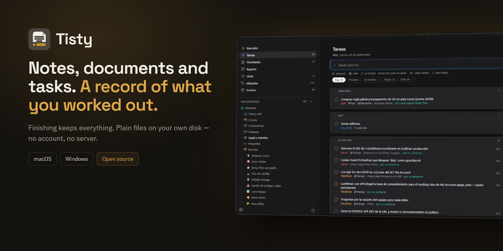
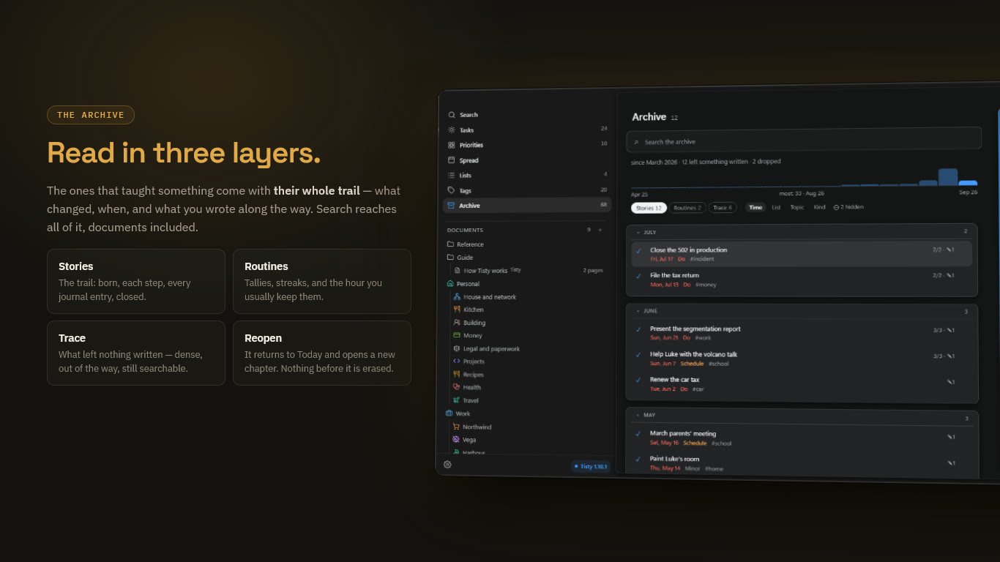
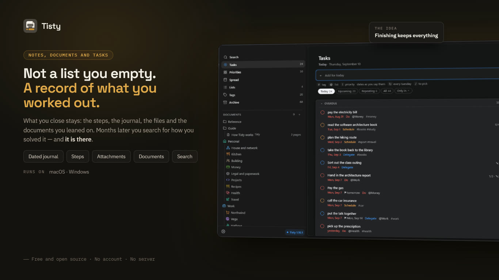
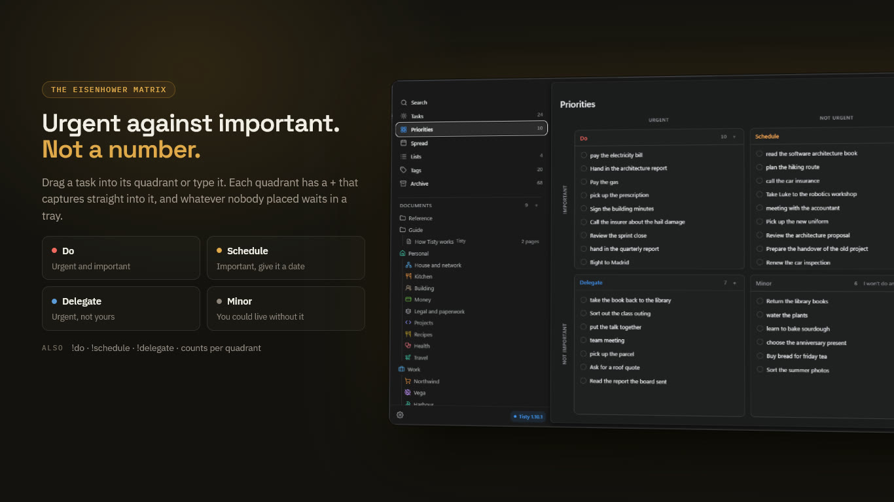
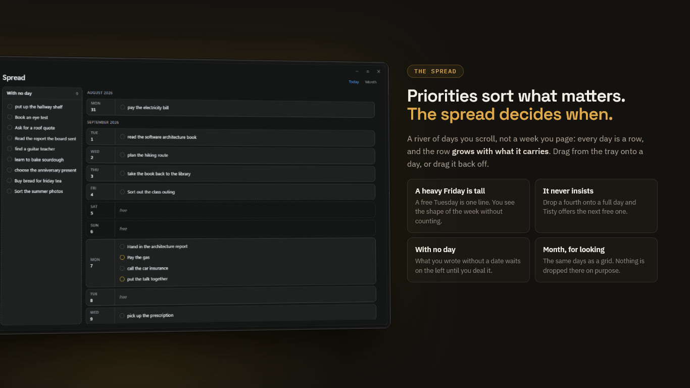
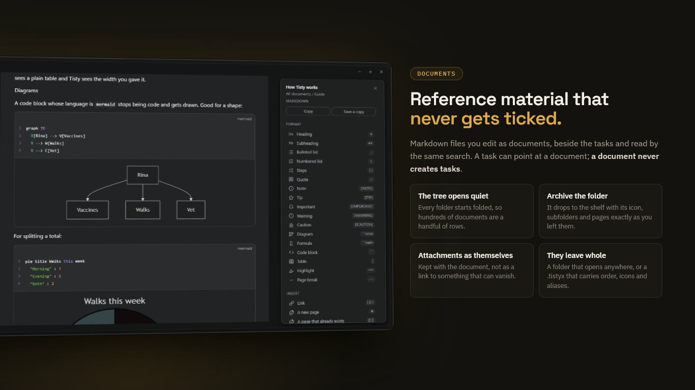
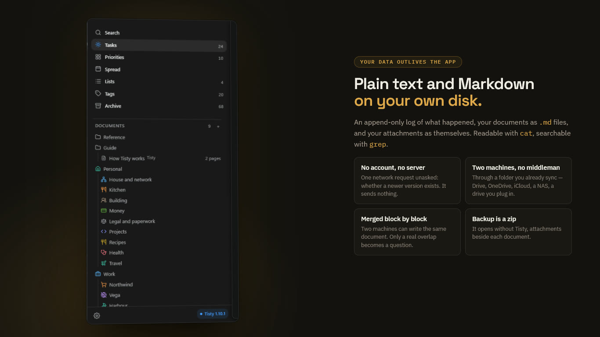

<div align="center">
  

  <h1>Tisty — Free Open Source Notes, Documents and Tasks</h1>

  <p><strong>Notes, documents and tasks that stay yours: plain Markdown on your
  own disk, for Windows and macOS.<br/>Not a to-do list you empty — a record of
  what you worked out, searchable years later, with an MCP door for your
  assistant.<br/>No accounts. No subscriptions. No telemetry. No
  server.</strong></p>

  <p>
    <strong>English</strong> ·
    <a href="README.es.md">Español</a>
  </p>

  <p>
    <a href="https://github.com/rgdevment/Tisty/releases">
      
    </a>
    <a href="#an-assistant-if-you-use-one">
      
    </a>
    
    <a href="#licence">
      
    </a>
    <a href="https://github.com/sponsors/rgdevment">
      
    </a>
    <a href="https://buymeacoffee.com/rgdevment">
      
    </a>
  </p>

  <p>
    
  </p>

  <h4>Download Tisty</h4>

  <p>
    <a href="https://apps.microsoft.com/detail/9PGVWXD8X93N">
      
    </a>
    <a href="#getting-started">
      
    </a>
  </p>

  <p>
    <sub>Prefer a direct download?
    <a href="https://github.com/rgdevment/Tisty/releases/latest">GitHub
    Releases</a> carries the signed installers — Windows (.exe) · macOS
    (.dmg, one per chip)</sub>
  </p>

</div>

---

**Tisty** is Opensource. Read it, build it, run it, or take one of the stable
releases already out there. Nothing is hidden and all of it can be audited.

It is not a **to-do app** as you know it. A list gets emptied and forgotten. Here
what you close stays: what you did, when, and what you worked out on the way.
Months later you search for how you solved something and it is there — the
description, the journal, the steps, the documents you leaned on.

I am not a company. I am a developer who kept solving the same problem twice, so
I built the **notes, documents and task manager** I wanted and gave it away. It
is meant to stay small and useful, not to grow a thousand features nobody uses.
No ads, no telemetry, no accounts, no subscriptions — a **local-first
productivity tool** that lives on your machine and nowhere else.

**Why people choose Tisty over other task managers:**

- **100% local** — your tasks, your journal and your documents never leave your
  computer. No cloud, no server, no account. If you sync two machines, you can
  ask Tisty to leave the largest attachments in that shared folder instead of
  carrying them onto every disk; it never does that unless you choose it.
- **Truly free** — no premium tier, no feature gates, no trial. AGPL v3, and
  [commercial terms](docs/COMMERCIAL.md) only for organisations that cannot
  comply with it.
- **Your data outlives the app** — plain text and Markdown on your own disk,
  readable with `cat` and searchable with `grep`.
- **Finishing keeps everything** — completing a task moves it to the archive
  with its steps, its notes and its attachments intact, documents included.
- **Fast and native** — a Rust core inside a Tauri window: it starts quickly,
  stays small, and looks like it belongs on both systems.

> I use Tisty every day on macOS and Windows. If something feels off,
> [open an issue](https://github.com/rgdevment/Tisty/issues) — this project
> keeps improving because of real-world use.
>
> **It is for one person, by design.** No assignees, no permissions, no boards.
> If you need to run a team, Tisty will not carry that.



## Table of Contents

- [Why I Built This](#why-i-built-this)
- [What It Is / What It Isn't](#what-it-is--what-it-isnt)
- [What Makes It Different](#what-makes-it-different)
- [Who Is This For?](#who-is-this-for)
- [The Idea It Is Built On](#the-idea-it-is-built-on)
- [Getting Started](#getting-started)
- [What It Does](#what-it-does)
- [Your Data and Privacy](#your-data-and-privacy)
- [Two Machines, If You Have Two](#two-machines-if-you-have-two)
- [A Command Line, If You Want One](#a-command-line-if-you-want-one)
- [An Assistant, If You Use One](#an-assistant-if-you-use-one)
- [What It Will Never Do](#what-it-will-never-do)
- [FAQ](#faq)
- [Alternatives](#alternatives)
- [Localization](#localization)
- [Other Tools by the Same Author](#other-tools-by-the-same-author)
- [Support the Project](#support-the-project)
- [Standing On](#standing-on)
- [Contributing](#contributing)
- [Licence](#licence)
- [Project health](#project-health)

## Why I Built This

Organising your day is harder than a list makes it look. There are more moving
parts than fit in your head, plans shift under you, and something you thought
was small turns out not to be. Which is why finishing it feels good.

But look at what the task gathered on the way. The steps it actually took. The
notes you wrote while working it out. What you looked up, what it turned out to
connect to, the documents you leaned on. That is where the effort went.

Mine looked like *"fix the intermittent timeouts on save"*. By the time it was
done it had collected the ticket, the commit, and two paragraphs explaining that
the real cause was a missing index on a table nobody was looking at.

Eight months later the same thing happened somewhere else. I remembered solving
it. I could not remember how — and the note that held the answer had gone with
the tick.

**That is the whole reason Tisty exists.** A task is not a line you cross out.
It is a tree: the steps, the journal, the files and the documents that grew
around it while you worked. Finishing it should not prune it.

I wanted it to stay mine, too. On my disk, in files I can open without asking
anyone. So I built the thing I wanted, used it until it stopped annoying me, and
put it here in case it is the thing you wanted too.

## What It Is / What It Isn't

**It is** a personal task manager where finishing something is the beginning of
its useful life. Tasks carry a description, a journal, steps and attachments;
when you complete one it moves to the archive, and search reaches all of it,
documents included.

**It is for one person.** No assignees, no permissions, no boards. If you need
to run a team, Tisty will not carry that, and you deserve to know before you
install it rather than after.

**It is not something I sell.** Nothing is locked, nothing expires, and there is
no version of this with more in it. It is a program I wrote for myself and gave
away.

**Your data is files.** Plain text on your own disk, readable with `cat` and
searchable with `grep`. If Tisty disappeared tomorrow, everything you wrote
would still be there and still make sense.

## What Makes It Different

If you are looking for a **free, open-source, offline task manager with no
account, no subscription and no AI**, this is what Tisty is:

| | |
|---|---|
| Your tasks live | in plain files on your own disk |
| Account | none, ever |
| Subscription | none. There is no paid tier and no upgrade |
| Offline | always. There is no server to be away from |
| AI inside | **none**, and none is coming |
| Your own assistant | yes, over **MCP**, if you choose to open the door |
| Priorities | the **Eisenhower matrix**, by its name |
| Sorting | lists, tags, steps and a journal on every task |
| Documents | written and searched beside the tasks, not in another app |
| Attachments | kept with the task, as themselves |
| Finished work | an **archive that keeps what each task taught you** |
| Two machines | through a folder you already sync. No server of ours |
| Natural language | dates, deadlines and repeats, parsed on your machine |
| When to do it | a spread of days you deal work onto, and a month for looking |
| Reminders | an hour you choose, that rings on this machine and nowhere else |
| Source | open, auditable, yours to fork |

**The Eisenhower matrix, not numbered priorities.** A task is urgent, important,
both or neither — *do*, *decide*, *delegate*, *drop*. That names the decision
instead of hiding it behind a number, and it is the difference between a list
that sorts and a list that helps you choose. Around it: lists for where work
belongs, tags for what cuts across, steps for the parts, and a journal for what
you learn on the way.

**Finishing is where it starts.** Most task managers treat a completed task as
rubbish to hide. Here it moves to an archive read in three layers: the ones that
taught something come with their whole trail — what changed, when, and what you
wrote — the routines come with their tallies and their streaks, and the rest is
the trace. Search reaches all of it, documents included. A year in, that archive
is the part you would miss.

**Your assistant, not one of ours.** Tisty has no AI in it. The natural language
that turns "call the bank at 3" into a task is rules running on your machine, no
model and no cloud. But it speaks [MCP](https://modelcontextprotocol.io), so an
assistant you already use can file work into it — with its steps, its date and
the list it belongs in, on this machine, with no account and nothing over the
network. You open that door, and you can close it.

**Two machines, no middleman.** If you already sync a folder, Tisty travels
through it. There is no server of ours in between, nothing to sign up for, and
nothing that stops working the day a company changes its mind.

**Free is not a tier here.** There is no upgrade, no seat count, no feature held
back for later. The reason is not generosity: a program that keeps your work on
your disk and never phones home has almost nothing to charge for, and asking
would make it worse.

## Who Is This For?

Someone who works alone, or mostly alone, and whose tasks leave a trail worth
keeping. Developers, sysadmins, freelancers, researchers, students — anyone who
has ever solved the same problem twice and known it the second time.

If what you want is a list to cross out and never open again, Tisty will feel
like more than you asked for. That is a fair reason to walk away.

## The Idea It Is Built On

**A completed task is not finished. It is archived.**

It stops being a reminder of what to do and becomes the record of how something
got solved. Three things follow from that, and they shaped everything else:

- **Search is the main way into the archive**, not a side feature.
- **Deleting is the exception.** The normal ending is completing, which keeps
  it. Erasing something for good is only for what is closed and reads as a
  trace; a story is only hidden, and converting it to a trace is the deliberate
  step that lets it go.
- **Capture has to stay instant**, because most tasks are not like that at all.
  The call you have to make tomorrow is born and dies within a day and leaves
  nothing worth keeping — and writing it down must not cost more than one line.

## Getting Started

**Windows** — from the
[Microsoft Store](https://apps.microsoft.com/detail/9PGVWXD8X93N), which keeps
it updated for you. About asks the Store for one on the spot when you would
rather not wait. Or with the Windows Package Manager, which takes the signed
installer from the releases page and then stands aside, because Tisty keeps
itself up to date:

```console
> winget install rgdevment.Tisty
```

**macOS** — with [Homebrew](https://brew.sh). The tap is added once and never
again. After that Tisty keeps itself up to date, so Homebrew stands aside:

```console
$ brew tap rgdevment/tap
$ brew install --cask tisty
```

Or take the disk image and the installer straight from
[Releases](https://github.com/rgdevment/Tisty/releases), on either system.
On macOS there are two images: `aarch64` for Apple Silicon and `x86_64` for
Intel — Apple menu › *About This Mac* says which one yours is. Homebrew picks
by itself.

## What It Does

**The first time it opens**, Tisty asks two things — which language, and where
your copies should go — and then writes you a guide and opens it. Everything
else it decides for you and lets you change later: it starts with the computer
and waits out of the way, because those were questions with an obvious answer.
The guide is a document in your own store, in a folder of its own: yours to
read, edit, or throw away like anything else you wrote.

**Settings answers four questions rather than wearing five labels.** *General*
is how Tisty behaves towards you — language, start-up, the quick capture,
notices, updates, and the two things that happen outside the window: the command
line and the welcome. *Your data* is everything that touches your files, with
syncing as a block of its own because it has a state, a warning that depends on
who keeps your folder, and four actions. *Assistants* and *Maintenance* are what
they say.

**Three columns at most:** what you are looking at, the list, and the task you
opened. Nothing else on screen.

**The list stands where it stands.** It does not drift to the middle of whatever
room is left, so opening a task moves nothing. Where the window is wide enough,
the space that opens up is not left blank: a column tells you the day — what is
overdue, what is for today, what is ahead, the four quadrants with their counts,
the lists holding something and the tags in use. All of it counts your whole
store rather than the slice on screen, and every figure is a way in. Narrow the
window and it steps aside; a task always wins the room over it.

**It reads what you write.** You type a sentence and Tisty takes the date out of
it, leaves the sentence readable, and shows you what it understood *before*
anything is saved — as chips you can correct with one click.



```text
"ship the release tomorrow at 10"   →  tomorrow 10:00
"file the report before friday"     →  due fri
"book the flights @travel #urgent"  →  @travel · #urgent
```

A day, a time, or both. Names, distances, plain dates. What it cannot read it
leaves alone rather than guess. A deadline is a different thing from a plan, and
three words open one: **before**, **due**, **until**.

**A task opens beside the list**, not on top of it: dates, list, tags, priority,
a description and a journal in Markdown, steps you tick one at a time, and
whatever you dropped on it. Completing it puts none of that out of reach. Opened
to the whole page it gains a column of its own trail — how long it has been
open, how much of it is done, and every change it has been through, which until
now sat at the bottom where nobody scrolled.

**Priorities are a matrix, not a ladder.** Tisty borrows the four quadrants
of the Eisenhower matrix — the method President Dwight D. Eisenhower is
credited with, popularised by Stephen Covey in *The 7 Habits of Highly
Effective People*: sort what you have by urgent against important, and each
quadrant tells you what to do with it. **Do** what is urgent and important,
**Schedule** what matters and is not urgent, **Delegate** what is urgent and is
not yours, and leave in **Minor** whatever you could live without — when you are
sure, one button drops the lot.

Drag a task into its quadrant, or type it: `!do`, `!schedule`, `!delegate`.
`!decide` still works, because it is what the quadrant used to be called. Each
quadrant has a **+** that opens the quick capture with that quadrant already
set, and whatever nobody has placed waits in a tray that opens the way you
left it.



**The spread deals your days, one row at a time.** Priorities sort what matters;
the spread decides when. It runs as a river of days you scroll through rather
than a week you page: every day is a row, and the row grows with what it carries,
so a heavy Friday is tall and a free Tuesday is a line. What you wrote with no
day waits in a tray on the left, and you drag it onto a day — or drag it back to
take the day away again. Drop one onto a day that already carries three and
Tisty says so, and offers the next day that is free; it never insists.

A **month** button is there for looking, not for dealing: press it and the same
days lay out as a grid, press a day and you land on it in the river. Nothing is
dropped there on purpose. Tisty cannot see the calendar you keep somewhere else,
so a square with nothing written on it is only a square with nothing written on
it — never a promise that the day is yours.



**Documents** live beside the tasks, for reference material that has no date and
never gets ticked. They are Markdown files you edit as documents — tables,
checklists, code, images — and search reads them too. A task can point at a
document; a document never creates tasks.

**The tree opens quiet and closes whole.** Every folder starts folded, so a store
with hundreds of documents is a handful of rows until you go looking. When work
is over you archive the folder itself, not its documents one by one: it drops to
the shelf at the foot of the tree with its icon, its subfolders and its pages
exactly as you left them, closed to writing and to anything new coming in. Bring
it back and it returns the same — including whichever documents you had archived
by hand in there, which stay archived because nobody said otherwise.

**A page is put away on its own without leaving its document.** A long thing in
parts — a year of minutes, a book by chapters — is one document holding pages,
and a chapter that no longer applies goes to the archive where it lives: dimmed,
with the icon of the archive, read but not written. Put the whole document away
and every page goes with it; bring it back and each one returns as it was, the
one you had set apart still apart.

**A document takes tags the way a task does** — you write `#contract` in the
middle of a sentence and the document is filed under it. The tag lives in the
sentence rather than in a hidden header, so carrying the file to another editor
carries the tag with it. Tags is where they meet: one screen, the tasks under a
tag and the documents beneath them, and pressing a tag inside a document opens
exactly that. Accents come off and case is folded, so `#camion` and `#camión`
are one word however you typed them that day. A bare number is not a tag —
`#1234` is the ticket somebody wrote down, not a subject — and neither is a
single letter: two characters, one of them a letter.

Text can be highlighted in a few colours and set apart as an aside — a plain
quote, or a callout GitHub reads too, written as `> [!WARNING]`. Tables keep how
their columns lean and how wide you drew them, and a code block says what
language it is and is coloured for it, with its lines numbered beside the text
rather than in it, so copying takes the code and nothing else. A block can carry
a name; one whose language is `mermaid` draws the diagram it describes
underneath — redrawn when you turn the light on or off — and one that says
`math` sets the formula it holds.

**A web link on a line of its own is drawn as a card**, made from the address
itself — the site's name and the words you wrote. Nothing is fetched to draw it.
Press **Bring the preview** and Tisty asks that page once for its title, its
description and the picture it offers, keeps the answer here so it never asks
again, and reads no more of it than it needs: a page cannot decide how much of
your machine it takes.

**It stays Markdown**, and that is the point rather than a detail: everything
above is syntax another reader already understands, so the file survives without
Tisty — a block's name is what Markdown keeps after the language, and a column's
width rides in how long its rule is drawn, which every other reader ignores and
draws the same. Where Markdown genuinely cannot say a thing — an icon in a line
of text — Tisty writes the small piece of HTML that can, and reads it back.
Where the editor meets a shape it is known not to keep — front matter,
footnotes, links written by reference, blocks of HTML — it says so and opens
the document read-only rather than quietly destroying it. That list is what it
checks, not a promise about everything a Markdown file can hold.

The writing sits on a lit page, and the first line with words in it is both the
name of the document and its title — reading past a fence or an alert's marker to
find it. When the window is wide enough a column opens beside it
with what the document is, the formatting the `/` menu used to hide, and its
outline. **Tisty makes its own PDF** — A4, Letter or one endless sheet, with its
own margins and the attachments carried inside — and shows it to you before you
export it.

**And they leave whole.** A document copies as Markdown, writes out into a
folder with its pages and attachments beside it, or is exported for Tisty into a
`.tistyx` file that also carries what Markdown cannot say: folders with their order,
icon and colour, which document each page hangs from, what is archived, and the
alias it was signed with. It carries a `README.txt` as well, so whoever you hand
it to can read the documents without Tisty and knows where to find it if they
want the rest. Exporting all of them asks who they
are for: open, to hand to somebody, or locked with six digits for another
machine of your own — which is what makes them arrive there as yours rather
than as a stranger's. Either way, not one line of the history travels inside.
Write an alias — optional, and yours to choose — and every document is signed
with it, while whatever arrives from somebody else keeps theirs.



**A global shortcut** opens a small field over whatever you are doing, so a task
that occurs to you mid-something does not cost you the something.

**Repeating tasks** come back one occurrence at a time, so the archive shows you
did it twelve times — and it counts what was owed rather than only what you
closed, so a routine reads 26 of 30 with four dates that have no record. Marking
one days late offers those dates back instead of calling them forgotten: tick the
ones you did and the gap closes. **Reminders** arrive as a system notification and
a short sound you can turn off. The whole window works from the keyboard.

**The archive is read in three layers.** The ones that taught something come with
their whole trail — what changed, when, and what you wrote along the way. The
routines come with their tallies, their streaks and the hour you usually keep
them. The rest is the trace: what left little or nothing written, listed dense
and out of the way, because it still happened and search still reaches it. You
decide which layer each one reads in: a story that was only noise goes to the
trace, and a trace worth keeping is kept as a story. The trace is the only layer
that can be erased, and both erasing and hiding are one task at a time; a story
is only ever hidden.

## Your Data and Privacy



Everything lives in one folder on your disk: an append-only log of what
happened, your documents as `.md` files, and your attachments as themselves.
Nothing is obfuscated and nothing is in a format only Tisty can read.

**Nothing is encrypted at rest**, and that is a decision rather than an
oversight — your operating system's permissions are the protection, and the
files stay readable with tools you already have. It is written out in
[PRIVACY.md](PRIVACY.md) and [SECURITY.md](SECURITY.md), including the parts
that are not reassuring.

Tisty makes **one** network request unasked — when it opens, and once a day
after that: it checks whether a newer version exists. It sends nothing. If one
does exist and you press the button that offers it, two more follow — the file
naming the release, and the installer — and Tisty refuses to install anything
not signed with a key compiled into the copy you already have.

## Two Machines, If You Have Two

Tell Tisty where to leave the copies. It offers Google Drive, OneDrive, iCloud
and Dropbox — whichever it finds installed, folder already worked out — or any
other folder both computers reach, a NAS, a drive you plug in on Fridays. The
rest it does on its own.

There is nothing of mine in the middle: no account, no server, no daemon. Who
runs that folder is your business, not Tisty's. If you sync nothing, it never
opens a connection at all.

Two machines can genuinely write the same document at once, and there Tisty
merges them **block by block** — you edit the introduction on one, someone edits
the closing paragraph on the other, and both land with nothing to answer. Only a
real overlap becomes a question.

**Or back up by hand.** One zip, kept wherever you like.

**Where the big ones live is yours to say.** By default every machine carries
every attachment, which is why any of them can open anything with the network
off. Settings offers two other ways: keep only what this machine attached and
fetch the rest when you open it, or — above 50 MB — leave them in the shared
folder and nowhere else. That last one trades the copy on your disk for the
space it took: the file is there when your provider or your NAS is, and Tisty
says so plainly when it is not. A copy is only ever let go of after the one in
the shared folder is found to hash the same.

And because what uploads that folder is your provider's program and not
Tisty, if you ever change something on one machine and it does not turn up
on the other, [FAQ.md](docs/FAQ.md) lists the causes worth checking, in order.

## A Command Line, If You Want One

The window is the way in. The terminal was a second one — the same store, the
same tasks, the same natural language — and it is being retired, by stages:
what it still does keeps working, no feature reaches it — only a rule the
window keeps for safety, which it obeys — and the task and document commands
go in the next major version. What stays is the `tisty`
binary itself, because it is the door your assistant comes through (`tisty
mcp`) and the place for maintenance: `doctor`, `sync`, `export`, `agent`.

```console
$ tisty doctor
$ tisty sync
$ tisty export --markdown
```

If you script against `tisty ls --json` or `tisty add`, plan to move: the
window is where Tisty happens, and the assistant's door is how a program
reaches it.

## An Assistant, If You Use One

**Tisty is not AI and has none inside.** The natural language that turns "call
the bank at 3" into a task is rules running on your machine: no model, no
request, no cloud. That is not going to change.

But if you already use an assistant, you are probably telling it things worth
keeping — the school group says card stock on Monday, the invoice is due on the
30th. So Tisty leaves a door, and you decide whether to use it.

Settings › Agents lists the assistants already installed on this computer and
connects the one you pick: it writes a single line into that assistant's own
settings, leaves the rest of that file where it was, and keeps a copy of it as
it was before. For one it does not know, a line does it:

```console
$ <your-assistant> mcp add tisty -- tisty mcp
```

Where `<your-assistant>` is whatever yours is called. It speaks
[MCP](https://modelcontextprotocol.io) on the same machine: no
account, no token, nothing over the network. **You are the one who opens it.**
The assistant appears in Settings › Agents as a device you have to let in, and
it stays a device you can throw out; until you do let it in, everything it
tries is refused.

What it may do is deliberately small: file a task with its steps and its date,
set an hour for it to ring at, move the day of a task it filed itself, say that
a task it filed is done — which marks it for you to confirm and closes nothing —
add to the journal, write a document, add to one that is already there — at the
end or under a heading — correct a passage of one, write one again whole, file
documents into folders, keep a copy of a file you point it at — on a task or
inside a document, which takes the larger file of the two — and read what is
already there. What it may not do: close a task or delete one, say a task you
wrote is done, move a day you set, delete a document, rename or empty a folder,
reach a task you folded away, take files from outside the folders where a
download lands, or file the same thing twice. A task you closed is history to
it: it comes with a notice saying so, reads as it ended, takes no note, no new
day, no bell and no file, and if the same work comes back the assistant
proposes a new one that says how the last one ended.

A task you wrote stays yours unless you say otherwise. Open one to agents from
its detail — «Allow agents» — and an assistant may say it is done,
for you to confirm; describe it, where there is no description yet; plan its
steps; and tick them off as it goes, which is the one thing it does without
asking. Its day, its title, its list and its closing stay yours all the same.
«No agents» shuts the door again and keeps what was filled in. What an
assistant writes is signed with the name of the program it spoke through —
«by Claude Code», «by Codex» — in the row, the detail and the journal, and
Settings › Assistants counts what each one wrote.

**The command line is yours, not the assistant's.** An assistant with a shell
could type `tisty done 3` the day its MCP server is not connected, and act as
you; or `tisty agent --on`, and let itself in. So `tisty` looks at who is at the
keyboard before it opens anything, and refuses every command but `tisty mcp`
when a coding assistant is — by the marks its environment carries, by what sits
above it in the process tree, or by an editor above it and no terminal at all.
And `tisty agent --on` asks you, on the terminal, before it lets anyone in: a
shell with no terminal to answer from is refused outright, whatever drives it.
The refusal is written for the assistant that reads it: go through the server,
or tell the person it is down. It is a heuristic, and an honest one: the same
user in the same shell cannot be told apart with certainty, so where your
assistant's client can turn the command down before it runs — a hook, a rule —
that is the layer that does not depend on the server, and this is the floor
beneath it.

It also reads sparingly, which is your business as much as its own. Tisty keeps
a small card for each document — its headings, how long it is, what it leans
on — worked out from the text itself, on this machine, and never sent anywhere.
An
assistant reads that to pick which document it needs, then asks for the part it
wants, or changes that part without having read the rest. A long document is not
poured into somebody's model because an assistant wanted one paragraph of it.
Having read one, it can leave a summary for the next one — kept on this machine,
never synced, and not part of what you wrote.
To correct a passage it has to name it exactly as you wrote it, and if that text
is not there or is there twice, nothing is written at all. To write a whole body
again it has to send back the print the document read at when it last looked: if
you have written in it since, the write is refused and it has to read again, so
what you typed while it was thinking cannot be lost. A document you archived it
can still read, and it is told that you archived it.

Whatever it reads travels wherever that assistant travels. That is between you
and it — which is precisely why this is a door you open, and not one that was
already open.

## What It Will Never Do

As important as the list above. Permanently out of scope: real-time
collaboration, kanban boards, Gantt charts, time tracking, productivity metrics,
databases with typed properties and formulas, and AI anywhere in the critical
path.

The natural language stays deterministic and local, and **Tisty never sends
anything to a model** — not a task, not a word. If you open the door in the
section above, whatever your assistant reads travels wherever that assistant
travels: Tisty still sends nothing, the assistant is the one carrying, and you
are the one who let it in.

## FAQ

**Is Tisty free?**
Yes, and it stays free. AGPL-3.0, no paid tier, no feature held back for a
later version, no trial that runs out. [Commercial terms](docs/COMMERCIAL.md)
exist only for organisations that cannot comply with the AGPL.

**Does it need an account or a connection?**
Neither. There is nothing to sign up for and no server to be away from. Tisty
makes one network request you did not ask for — when it opens, and once a day
after that — to see whether a newer version exists, and it sends nothing in
order to ask. Take the machine off the network and everything else works the
same.

**Where is my data kept?**
In one folder on your own disk: an append-only log of what happened, your
documents as `.md` files, and your attachments as themselves. Settings › *Your
data* prints the path and *Show the store* opens it. Nothing is obfuscated and
nothing is in a format only Tisty can read.

**What happens to my notes if Tisty disappears?**
They stay where they are. Markdown and plain text, readable with `cat`,
searchable with `grep`, openable in any editor you already have. That is what
the format is for.

**Does Tisty use AI?**
No, and none is coming. The natural language that turns "call the bank at 3"
into a task is rules running on your machine: no model, no request, no cloud.
If you already use an assistant of your own, Tisty leaves an
[MCP](https://modelcontextprotocol.io) door — you open it, you can close it
again, and until you do everything it tries is refused.

**Can I use it on two computers?**
Yes, through a folder you already sync: Google Drive, OneDrive, iCloud,
Dropbox, a NAS, a drive you plug in on Fridays. There is no server of mine in
between, no account, and nothing that stops working the day a company changes
its mind.

**Is there a mobile app?**
No. Tisty is a desktop program for Windows and macOS. Your documents are
Markdown in a folder, so a phone that reaches that folder reads and edits them
with whatever app you like — but the window, the spread and the archive are the
desktop's.

**Does it run on Linux?**
There is no Linux build today. The core is Rust and the window is Tauri, so
nothing in the design stands in the way; what is missing is the packaging and
somebody to keep it working on the distributions people actually run.

**Is my data encrypted?**
No, and that is a decision rather than an oversight: your operating system's
permissions are the protection, and the files stay readable with tools you
already have. [PRIVACY.md](PRIVACY.md) writes it out, including the parts that
are not reassuring.

**Can I use it with my team?**
No. Tisty is for one person by design — no assignees, no permissions, no
boards — and you deserve to know that before you install it rather than after.

**Can I bring my notes over from another app?**
Documents, yes: *Import a document* in the tree takes a `.md`, `.markdown` or
`.txt` file and brings it in one at a time, and a `.tistyx` from another Tisty
machine unpacks whole. Tasks have to be typed. There is no importer for another
program's task list, and one that guessed would cost you more than the typing.

**Are the downloads signed?**
Yes. The macOS disk images are signed and notarised by Apple, and the Windows
installer is signed too — a copy from the Microsoft Store or from Homebrew
carries that already. Tisty also refuses to install an update that is not
signed with a key compiled into the copy you are running.

**Does it work with a screen reader?**
Not as far as anybody knows, and that is worth saying plainly: the whole window
works from the keyboard and that path is tested, but nothing has ever been
tried with a real screen reader. If you use one, an issue saying where it falls
apart would be the most useful thing anyone could send.

**How is it different from Obsidian, Notion or Todoist?**
Tisty keeps tasks and documents in one store and one search, and finishing a
task keeps everything it gathered instead of hiding it. The table below says
where each of those is stronger.

## Alternatives

Other places to keep notes and tasks, so you can pick the one that fits.
Platform, storage and licence checked against each project in September 2026;
everything else changes, so go and look.

| Project | Platform | Where your data lives | Licence |
| :-- | :-- | :-- | :-- |
| **Tisty** | Windows, macOS | Your disk, no account | AGPL-3.0 |
| [Obsidian](https://obsidian.md) | Windows, macOS, Linux, iOS, Android | Your disk; syncing is a paid extra | Closed source, free for personal use |
| [Logseq](https://github.com/logseq/logseq) | Windows, macOS, Linux, iOS | Your disk | AGPL-3.0 |
| [Joplin](https://github.com/laurent22/joplin) | Windows, macOS, Linux, Android, iOS | Your disk; syncing through a service you pick | AGPL-3.0 |
| [AppFlowy](https://github.com/AppFlowy-IO/AppFlowy) | Windows, macOS, Linux, Android, iOS | Your disk, or a server you pick | AGPL-3.0 |
| [Anytype](https://github.com/anyproto/anytype-ts) | Windows, macOS, Linux | Your disk, synced encrypted | Any Source Available 1.0 |
| [SilverBullet](https://github.com/silverbulletmd/silverbullet) | Self-hosted, in a browser | A server you run | MIT |
| [Super Productivity](https://github.com/johannesjo/super-productivity) | Windows, macOS, Linux, mobile | Your disk; syncing through a service you pick | MIT |
| [Taskwarrior](https://github.com/GothenburgBitFactory/taskwarrior) | Command line | Your disk | MIT |
| [Things 3](https://culturedcode.com/things/) | macOS, iOS | Your device; their cloud to sync | Paid, closed source |
| [Craft](https://www.craft.do) | macOS, iOS, Windows, Android, web | Their cloud; a local folder gives up sharing | Freemium, closed source |
| [Todoist](https://todoist.com) | Everywhere | Their servers, and an account | Freemium, closed source |
| [Notion](https://www.notion.com) | Everywhere | Their servers, and an account | Freemium, closed source |

What Tisty does that most of these do not: tasks and documents in one store and
one search, an archive that keeps a finished task whole instead of hiding it,
the Eisenhower matrix by its name rather than a number from one to four, and a
door for the assistant you already use with no AI inside the program itself.

Each of them is better than Tisty at something. Obsidian and Logseq are
notebooks with a decade of plugins, and tasks are one of those plugins' job.
Craft makes the handsomest document of the lot, and asks you to keep it in its
cloud for the sharing to work. Notion models anything you can describe, once
you and your data have an account there. Todoist and Things are quicker at
catching a task than anything here — and when that task is done, what you
worked out on the way has nowhere to stay. Joplin and AppFlowy are the closest
in spirit to this one, and either is worth your time if a phone matters to you
more than an archive.

## Localization

The window, the guide, the welcome and the natural language all speak the
language you chose the first time Tisty opened, and Settings changes it
whenever you like.

| Language | Tag | Status |
| :-- | :-: | :-: |
| English | en | Complete |
| Spanish | es | Complete |

Want yours in there? [Open an issue](https://github.com/rgdevment/Tisty/issues)
and say so — the window's strings live in one file, `app/src/locales.ts`, and
the rest follows from it.

## Other Tools by the Same Author

Same idea, same terms: free, open source, no ads, no telemetry, everything
local.

- **[CopyPaste](https://github.com/rgdevment/CopyPaste)** — a clipboard manager
  for Windows and macOS.
- **[LinkUnbound](https://github.com/rgdevment/LinkUnbound)** — a browser
  selector for Windows and macOS: it asks which browser should open a link
  instead of assuming.

## Support the Project

Tisty is free and will stay free: no ads, no premium tier, no paywall. If it
saves you time and you would like it to keep being maintained:

<p>
  <a href="https://github.com/sponsors/rgdevment">
    
  </a>
  <a href="https://buymeacoffee.com/rgdevment">
    
  </a>
</p>

And if you would rather not pay for anything, that is entirely fine. Star the
repository so somebody else finds it, tell one person it exists, or open an
issue when something is wrong. That is worth as much.

## Standing On

Tisty is small because other people's work does the heavy lifting.

**The core, in Rust** — [Tauri](https://tauri.app) puts a native window around
it without shipping a browser; [serde](https://serde.rs) reads and writes every
line of the log; [jiff](https://github.com/BurntSushi/jiff) does the dates and
the time zones, which is the part nobody should write twice;
[SQLite](https://sqlite.org), through
[rusqlite](https://github.com/rusqlite/rusqlite), holds the read cache;
[clap](https://github.com/clap-rs/clap) is the command line;
[ULID](https://github.com/dylanhart/ulid-rs) gives every task an identifier that
sorts by time and needs no coordination.

**The window** — [React](https://react.dev) draws it and
[Tailwind CSS](https://tailwindcss.com) styles it;
[TipTap](https://tiptap.dev) and [ProseMirror](https://prosemirror.net) are the
document editor; [markdown-it](https://github.com/markdown-it/markdown-it)
renders the prose everywhere else;
[Mermaid](https://mermaid.js.org) draws the diagrams a code block describes and
[KaTeX](https://katex.org) sets its formulas;
[lowlight](https://github.com/wooorm/lowlight) and
[highlight.js](https://highlightjs.org) colour the code;
[react-pdf](https://react-pdf.org) makes the PDF; [Vite](https://vite.dev)
builds it and [Vitest](https://vitest.dev) tests it.

The full list, with versions and licences, is in `Cargo.lock` and
`app/package-lock.json`.

## Contributing

How the store, the merge and the sync actually work is written down in
[ARCHITECTURE.md](docs/ARCHITECTURE.md) — a reference for the behaviour,
not a tour of the code.

Read [CONTRIBUTING.md](CONTRIBUTING.md). Open an issue before writing code for
anything beyond a fix: Tisty is deliberately minimal, and a well-written feature
can still be declined — usually because it would make the tool something other
than what it is.

## Licence

[AGPL-3.0](LICENSE), and available under
[commercial terms](docs/COMMERCIAL.md) for organisations that cannot comply
with it.

The signed builds in the app stores carry their own terms, because the stores'
do not accept the AGPL — [DISTRIBUTION.md](docs/DISTRIBUTION.md) says which
applies to what you have, and why. Nothing is withheld from the source either way.

## Project health

<p>
  <a href="https://github.com/rgdevment/Tisty/actions/workflows/ci.yml">
    
  </a>
  <a href="https://github.com/rgdevment/Tisty/actions/workflows/mutants.yml">
    
  </a>
  <a href="https://dashboard.stryker-mutator.io/reports/github.com/rgdevment/Tisty/main">
    
  </a>
  <a href="https://sonarcloud.io/summary/overall?id=rgdevment_Tisty">
    
  </a>
  <a href="https://sonarcloud.io/component_measures?id=rgdevment_Tisty&metric=coverage">
    
  </a>
</p>
