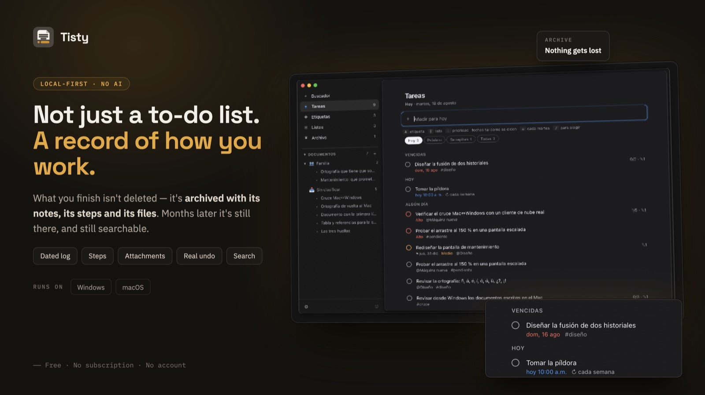
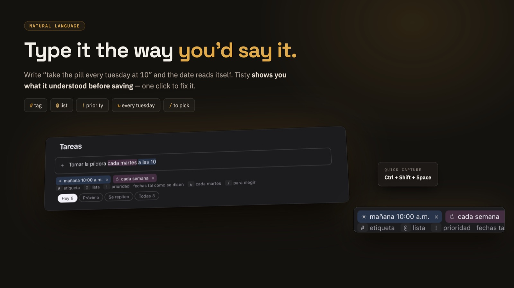
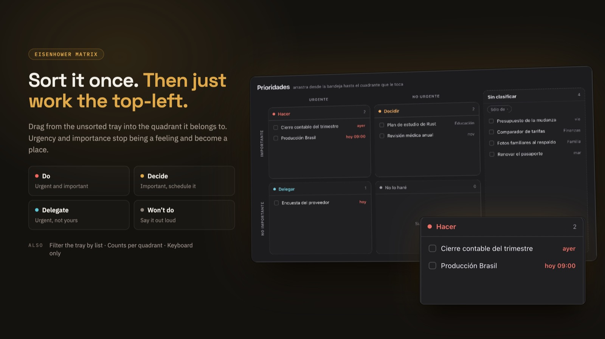
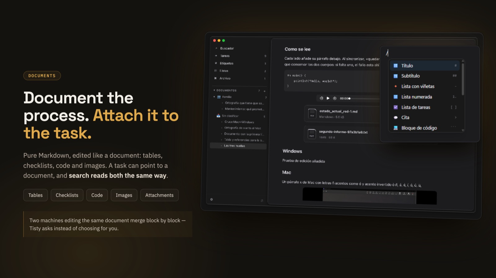
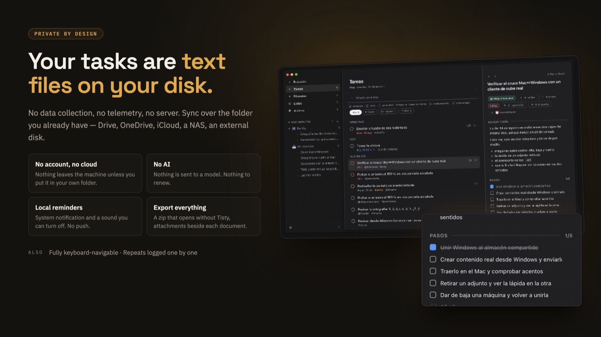

# Tisty

**English** · [Español](README.es.md)

**Your tasks leave something behind. Tisty keeps it.** A personal task
manager for macOS and Windows, on your own disk, with no account.



## Why I built this

Organising your day is harder than a list makes it look. There are more moving
parts than fit in your head, plans shift under you, and something you thought
was small turns out not to be. Which is why finishing it feels good.

But look at what the task gathered on the way. The steps it actually took. The
notes you wrote while working it out. What you looked up, what it turned out to
connect to, the documents you leaned on. That is where the effort went.

Mine looked like *"fix the intermittent timeouts on save"*. By the time it was
done it had collected the ticket, the commit, and two paragraphs explaining that
the real cause was a missing index on a table nobody was looking at.

Eight months later the same thing happened somewhere else. I remembered solving
it. I could not remember how — and the note that held the answer had gone with
the tick.

**That is the whole reason Tisty exists.** A task is not a line you cross out.
It is a tree: the steps, the journal, the files and the documents that grew
around it while you worked. Finishing it should not prune it.

I wanted it to stay mine, too. On my disk, in files I can open without asking
anyone. So I built the thing I wanted, used it until it stopped annoying me, and
put it here in case it is the thing you wanted too.

## What it is, and what it isn't

**It is** a personal task manager where finishing something is the beginning of
its useful life. Tasks carry a description, a journal, steps and attachments;
when you complete one it moves to the archive, and search reaches all of it,
documents included.

**It is for one person.** No assignees, no permissions, no boards. If you need
to run a team, Tisty will not carry that, and you deserve to know before you
install it rather than after.

**It is not something I sell.** Nothing is locked, nothing expires, and there is
no version of this with more in it. It is a program I wrote for myself and gave
away.

**Your data is files.** Plain text on your own disk, readable with `cat` and
searchable with `grep`. If Tisty disappeared tomorrow, everything you wrote
would still be there and still make sense.

## Who it's for

Someone who works alone, or mostly alone, and whose tasks leave a trail worth
keeping. Developers, sysadmins, freelancers, researchers, students — anyone who
has ever solved the same problem twice and known it the second time.

If what you want is a list to cross out and never open again, Tisty will feel
like more than you asked for. That is a fair reason to walk away.

## The idea it is built on

**A completed task is not finished. It is archived.**

It stops being a reminder of what to do and becomes the record of how something
got solved. Three things follow from that, and they shaped everything else:

- **Search is the main way into the archive**, not a side feature.
- **Deleting is the exception.** The normal ending is completing, which keeps it.
- **Capture has to stay instant**, because most tasks are not like that at all.
  The call you have to make tomorrow is born and dies within a day and leaves
  nothing worth keeping — and writing it down must not cost more than one line.

## Installing

**Windows** — from the
[Microsoft Store](https://apps.microsoft.com/detail/9PGVWXD8X93N), which keeps
it updated for you.

**macOS** — with [Homebrew](https://brew.sh). The tap is added once and never
again; after that, Tisty updates like anything else you have installed:

```console
$ brew tap rgdevment/tap
$ brew install --cask tisty
$ brew upgrade --cask tisty
```

Or take the disk image and the installer straight from
[Releases](https://github.com/rgdevment/Tisty/releases), on either system.

## What it does

**Three columns at most:** what you are looking at, the list, and the task you
opened. Nothing else on screen.

**It reads what you write.** You type a sentence and Tisty takes the date out of
it, leaves the sentence readable, and shows you what it understood *before*
anything is saved — as chips you can correct with one click.



```text
"ship the release tomorrow at 10"   →  tomorrow 10:00
"file the report before friday"     →  due fri
"book the flights @travel #urgent"  →  @travel · #urgent
```

A day, a time, or both. Names, distances, plain dates. What it cannot read it
leaves alone rather than guess. A deadline is a different thing from a plan, and
three words open one: **before**, **due**, **until**.

**A task opens beside the list**, not on top of it: dates, list, tags, priority,
a description and a journal in Markdown, steps you tick one at a time, and
whatever you dropped on it. Completing it puts none of that out of reach.

**Priorities are a matrix, not a ladder.** Tisty borrows the four quadrants
of the Eisenhower matrix — the method President Dwight D. Eisenhower is
credited with, popularised by Stephen Covey in *The 7 Habits of Highly
Effective People*: sort what you have by urgent against important, and each
quadrant tells you what to do with it. **Do** what is urgent and important,
**Decide** when to do what matters and is not urgent, **Delegate** what is
urgent and is not yours, and **Drop** what you are not going to do. Drag a
task into its quadrant, or type it: `!do`, `!decide`, `!delegate`. Whatever
nobody has placed waits in a tray you open when you want to empty it.



**Documents** live beside the tasks, for reference material that has no date and
never gets ticked. They are Markdown files you edit as documents — tables,
checklists, code, images — and search reads them too. A task can point at a
document; a document never creates tasks.

The writing sits on a lit page, and its first line is both the name of the
document and its title. When the window is wide enough a column opens beside it
with what the document is, the formatting the `/` menu used to hide, and its
outline. **Tisty makes its own PDF** — A4, Letter or one endless sheet, with its
own margins and the attachments carried inside — and shows it to you before you
export it.



**A global shortcut** opens a small field over whatever you are doing, so a task
that occurs to you mid-something does not cost you the something.

**Repeating tasks** come back one occurrence at a time, so the archive shows you
did it twelve times. **Reminders** arrive as a system notification and a short
sound you can turn off. The whole window works from the keyboard.

## Your data



Everything lives in one folder on your disk: an append-only log of what
happened, your documents as `.md` files, and your attachments as themselves.
Nothing is obfuscated and nothing is in a format only Tisty can read.

**Nothing is encrypted at rest**, and that is a decision rather than an
oversight — your operating system's permissions are the protection, and the
files stay readable with tools you already have. It is written out in
[PRIVACY.md](PRIVACY.md) and [SECURITY.md](SECURITY.md), including the parts
that are not reassuring.

Tisty makes **one** network request in its life: once a day it checks whether a
newer version exists. It sends nothing, and you can turn it off.

## Two machines, if you have two

Point Tisty at a folder both computers already reach — whatever your Google
Drive, OneDrive or iCloud client keeps in step, a NAS, a drive you plug in on
Fridays — and it does the rest on its own.

There is nothing of mine in the middle: no account, no server, no daemon. Who
runs that folder is your business, not Tisty's. If you sync nothing, it never
opens a connection at all.

Two machines can genuinely write the same document at once, and there Tisty
merges them **block by block** — you edit the introduction on one, someone edits
the closing paragraph on the other, and both land with nothing to answer. Only a
real overlap becomes a question.

**Or back up by hand.** One zip, kept wherever you like.

And because what uploads that folder is your provider's program and not
Tisty, if you ever change something on one machine and it does not turn up
on the other, [FAQ.md](docs/FAQ.md) lists the causes worth checking, in order.

## A command line, if you want one

The window is the main way in. But everything it does, the terminal does too:
the same store, the same tasks, the same natural language. It exists because I
wanted it, and it is entirely optional.

```console
$ tisty "call the bank at 3"
$ tisty ls today
$ tisty done 2
```

Settings puts it within reach of your terminal, or you can install only the
command with `brew install rgdevment/tap/tisty-cli` and never open the window.

## Where it stands

| | |
|---|---|
| ✅ | Tasks, lists, tags, steps, journal, attachments, archive, search |
| ✅ | Natural language for dates, deadlines and repeats |
| ✅ | The window, the tray, and quick capture on a global shortcut |
| ✅ | Documents: editor, folders, and sync that merges block by block |
| ✅ | Reminders, backup, and sync through a folder both machines reach |
| ✅ | macOS: signed and notarised. Windows: signed installer |
| ◐ | Daily use, which is what turns up the bugs tests do not |
| ◐ | The Microsoft Store package, waiting on a reserved name |

Two things are known and accepted rather than pending: you cannot reorder by
hand in the window — HTML drag and drop does not survive the native file drop
that attachments need, and attachments were the better trade — and nothing has
been tested with a real screen reader, though the keyboard path has.

## What it will never do

As important as the list above. Permanently out of scope: real-time
collaboration, kanban boards, Gantt charts, time tracking, productivity metrics,
databases with typed properties and formulas, and AI anywhere in the critical
path.

The natural language stays deterministic and local. Nothing is ever sent to a
model.

## Other tools I've made

Same idea, same terms: free, open source, no ads, no telemetry, everything
local.

- **[CopyPaste](https://github.com/rgdevment/CopyPaste)** — a clipboard manager
  for Windows, macOS and Linux.
- **[LinkUnbound](https://github.com/rgdevment/LinkUnbound)** — a browser
  selector for Windows and macOS: it asks which browser should open a link
  instead of assuming.

## Standing on

Tisty is small because other people's work does the heavy lifting.

**The core, in Rust** — [Tauri](https://tauri.app) puts a native window around
it without shipping a browser; [serde](https://serde.rs) reads and writes every
line of the log; [jiff](https://github.com/BurntSushi/jiff) does the dates and
the time zones, which is the part nobody should write twice;
[SQLite](https://sqlite.org), through
[rusqlite](https://github.com/rusqlite/rusqlite), holds the read cache;
[clap](https://github.com/clap-rs/clap) is the command line;
[ULID](https://github.com/dylanhart/ulid-rs) gives every task an identifier that
sorts by time and needs no coordination.

**The window** — [React](https://react.dev) draws it and
[Tailwind CSS](https://tailwindcss.com) styles it;
[TipTap](https://tiptap.dev) and [ProseMirror](https://prosemirror.net) are the
document editor; [markdown-it](https://github.com/markdown-it/markdown-it)
renders the prose everywhere else; [Vite](https://vite.dev) builds it and
[Vitest](https://vitest.dev) tests it.

The full list, with versions and licences, is in `Cargo.lock` and
`app/package-lock.json`.

## Contributing

How the store, the merge and the sync actually work is written down in
[ARCHITECTURE.md](docs/ARCHITECTURE.md) — a reference for the behaviour,
not a tour of the code.

Read [CONTRIBUTING.md](CONTRIBUTING.md). Open an issue before writing code for
anything beyond a fix: Tisty is deliberately minimal, and a well-written feature
can still be declined — usually because it would make the tool something other
than what it is.

## Licence

[AGPL-3.0](LICENSE), and available under
[commercial terms](docs/COMMERCIAL.md) for organisations that cannot comply
with it.

The signed builds in the app stores carry their own terms, because the stores'
do not accept the AGPL — [DISTRIBUTION.md](docs/DISTRIBUTION.md) says which
applies to what you have, and why. Nothing is withheld from the source either way.
