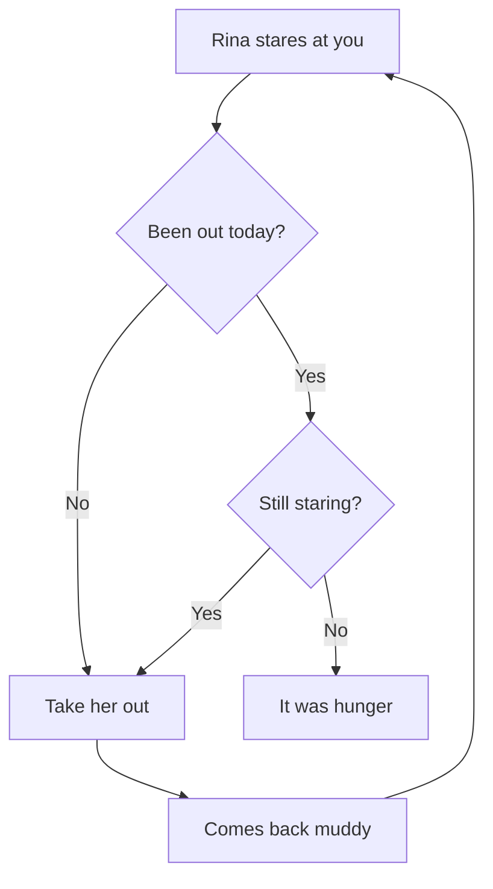

# When what you keep is code

The other page showed you what a page is. This one shows you what pages are actually for: the fix you worked out at eleven at night and will not remember six months from now.

A code block is coloured by its language, and `title=` gives it the file's name. Type `/` and pick **Code block**.

```rust title="src/walk.rs"
fn time_to_take_her_out(hour: u8, been_out: bool) -> bool {
    match (hour, been_out) {
        (7..=9, false) => true,
        (20..=22, false) => true,
        _ => false,
    }
}
```

That is Rust, which is what Tisty is made of. And this is the same thing told as a flow, which sometimes lands faster:



A program's settings, in JSON, in colour:

```json title="settings.json"
{
  "language": "en",
  "walks": ["08:00", "21:00"],
  "remind": true,
  "vet": { "name": "South Clinic", "phone": "+56 9 1234 5678" }
}
```

A query you wrote once and that worked:

```sql title="spending.sql"
SELECT month, SUM(amount) AS total
FROM spending
WHERE category = 'vet'
GROUP BY month
ORDER BY total DESC;
```

The command you can never remember:

```bash title="backup.sh"
rsync -a --delete ~/Tisty/ /Volumes/Backup/Tisty/
```

And what changed between the version that worked and the one that did not:

```diff
- const WALKS: u8 = 1;
+ const WALKS: u8 = 2;
```

> [!TIP]
> The file's name shows in the block's header, and it reaches the PDF too. Print this page and the colours come with it.

When code sits inside a sentence it goes between backticks: `cargo build --release`, `Ctrl` + `C`, `~/.config/tisty`. That is inline code, and it is not coloured because it does not need to be.

One note worth more than the code itself: write **why** it was like that underneath. The block tells you what you did; the line after it tells you why, and that is the part you forget.
