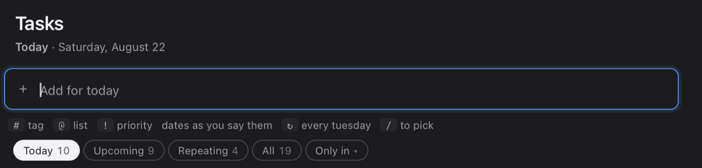
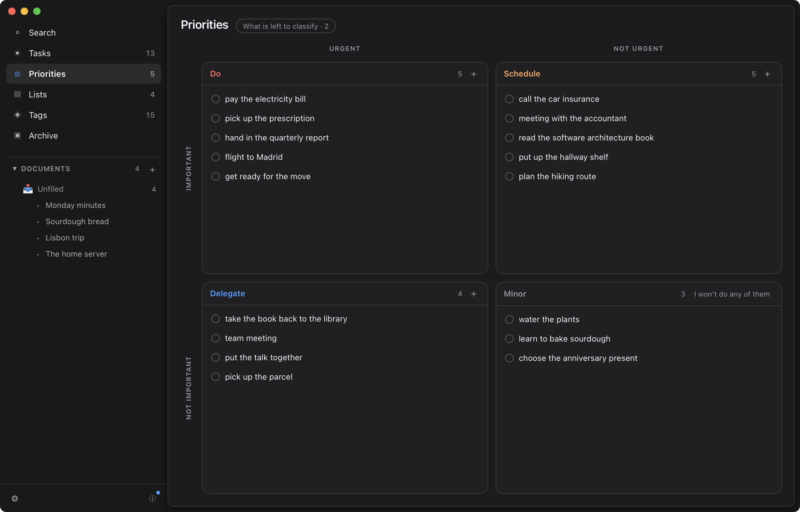

# How Tisty works

Tisty keeps your tasks in files of your own, on this computer. There is no
account to create and no server to ask: what you write stays where you can read
it, even without Tisty in front of you.

This document takes ten minutes, and you can come back to it whenever you like
from Settings.

## 1. Write it the way you would say it

There is no form to fill in. Type the whole sentence in the bar at the top and
Tisty pulls the day, the list and the priority out of it as you go.

The colours say what it understood, and these are them:

| You write | It understands |
| --- | --- |
| <mark data-pen="blue">tomorrow 10am</mark> | a day and a time, said out loud |
| <mark data-pen="blue">on friday</mark> | the next one coming |
| <mark data-pen="pink">every tuesday</mark> | something that comes back |
| <mark data-pen="pink">#home</mark> | a tag: what it is about |
| <mark data-pen="green">@work</mark> | a list: where it happens |
| <mark>!schedule</mark> | do, schedule, delegate or minor |

If a part stays plain, it simply belongs to the title, which is no great loss.

Try these:

- `Go through the report on friday !do @work`
- `Water the plants every tuesday`
- `Renew the passport 3 october #paperwork`

## 2. Capture without opening the window

Press <kbd>Ctrl</kbd> + <kbd>Shift</kbd> + <kbd>Space</kbd> wherever you are and
a small window opens for one task. Enter files it, Esc closes it, and you carry
on with what you were doing.

If another program already holds that shortcut, Tisty takes another one and
tells you which in Settings.

## 3. Today

The task list is read in stretches:

- **Today** — what is due, overdue included.
- **Upcoming** — what is coming.
- **Repeating** — what comes back on its own.
- **All** — everything open, unfiltered.

Anything overdue sits at the top, in red. There is no prize for emptying the
list.

## 4. Priorities are a map, not a ladder

Two questions, four boxes: whether it is pressing, and whether it matters.

- **Do** — urgent and important. Today.
- **Schedule** — important, no rush. Give it a date before it turns urgent.
- **Delegate** — pressing, but not yours to carry.
- **Minor** — neither pressing nor important. That quadrant has its own «I
  won't do any of them».

Drag a task into the box it belongs in. Whatever you leave unclassified waits in
the tray beside it, without nagging.

## 5. Lists and tags

Two ways of sorting that do not compete:

- A **list** says where it happens: <mark data-pen="green">@home</mark>,
  <mark data-pen="green">@work</mark>. A task belongs to one.
- A **tag** says what it is about: <mark data-pen="pink">#health</mark>,
  <mark data-pen="pink">#shopping</mark>. A task carries as many as you like.

## 6. Documents

A document is text of yours, kept as Markdown, that you can write here and read
with anything else.

- Write with bold, lists, tables and code blocks.
- Drag a file in to attach it.
- Type `/` to insert an image, a link, or **another document**, which comes in
  as a card you can open.
- With `/` you can also ==highlight== a phrase, centre a paragraph or push it
  to the right.
- Print, or save as PDF, from the panel itself.

Page breaks look like real breaks: the sheet ends and another one starts.

## 7. Your copies

Tisty always works on this computer. To reach it from another one, point it at a
folder iCloud, Google Drive or OneDrive already keeps in sync: copies go there
and the other computer picks them up.

> There is no server of ours in between. Syncing gives you redundancy, not time
> travel: if you delete a task, the deletion travels too.

Settings can also write you a full backup whenever you want one.

## 8. Completing, dropping and erasing

- **Completing** a task marks it done and sends it to the Archive.
- **Dropping** puts it aside without doing it: it lands in the Archive too.
- What is in the Archive stays there in case you look for it.

> **Before erasing for good.** It is only possible for what is already archived
> **and** put away out of sight. Erasing takes it off this computer, and off the
> others at the next sync, with no undo.

Files you had attached do not go with it, because another document might still
be using them. They stay behind as loose files, and Settings → Maintenance lists
them for you to let go of when you want.

## 9. Shortcuts

| Shortcut | What it does |
| --- | --- |
| <kbd>Ctrl</kbd> + <kbd>Shift</kbd> + <kbd>Space</kbd> | Capture without opening the window |
| <kbd>Ctrl</kbd>/<kbd>⌘</kbd> + <kbd>Enter</kbd> | Complete the task you are on |
| <kbd>/</kbd> | Insert inside a document |
| <kbd>Ctrl</kbd>/<kbd>⌘</kbd> + <kbd>X</kbd> · <kbd>V</kbd> | Move a document between folders |
| <kbd>Esc</kbd> | Close whatever is open |
