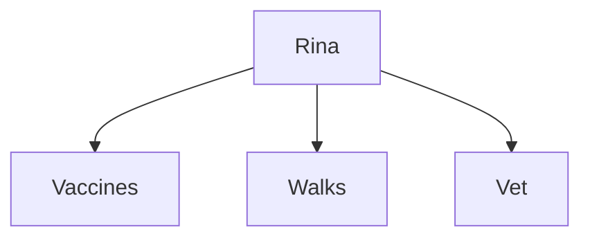
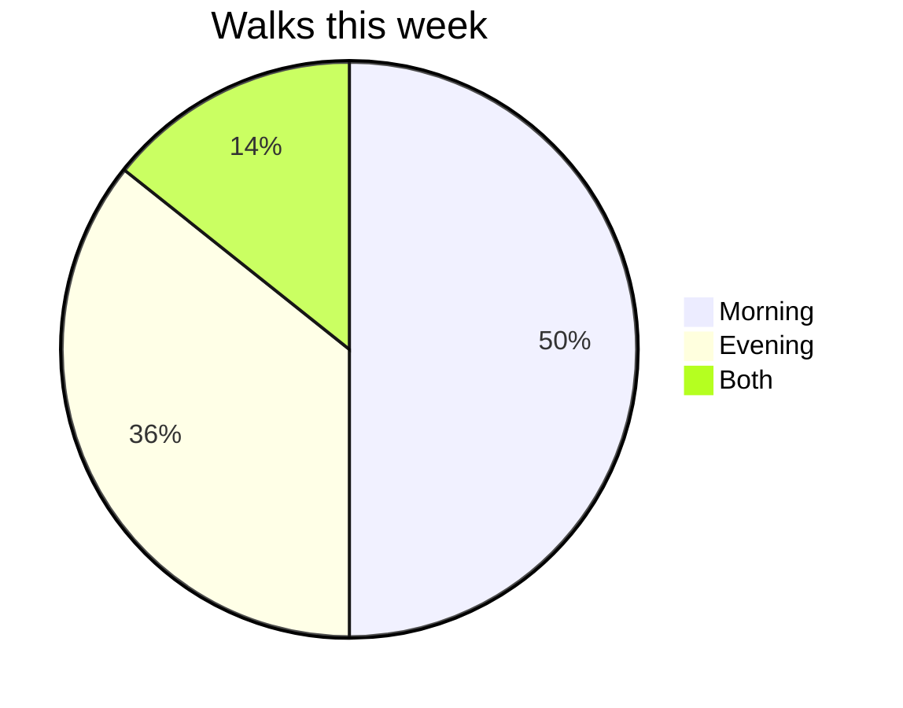
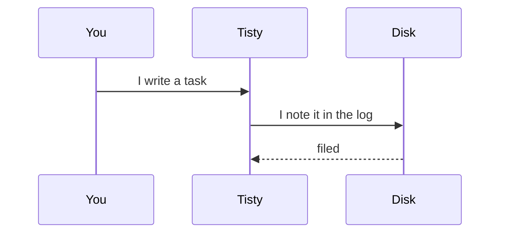

# How Tisty works

Tisty keeps your tasks in files of your own, on this computer. There is no account to create and no server to ask: what you write stays where you can read it, even without Tisty in front of you.

This document takes a while to read and you can come back to it whenever you like from Settings. It is written with the same tools it shows you, so everything you see here is something you can write yourself.

## 1. Write it the way you would say it

There is no form to fill in. Type the whole sentence in the bar at the top and Tisty pulls the day, the list and the priority out of it as you go.


The colours say what it understood, and these are them:

| You write | It understands |
| --- | --- |
| <mark data-pen="blue">tomorrow 10am</mark> | a day and a time, said out loud |
| <mark data-pen="blue">on friday</mark> | the next one coming |
| <mark data-pen="pink">every tuesday</mark> | something that comes back |
| <mark data-pen="pink">#home</mark> | a tag: what it is about |
| <mark data-pen="green">@work</mark> | a list: where it happens |
| ==!schedule== | do, schedule, delegate or minor |

If a part stays plain, it simply belongs to the title, which is no great loss.

Try these:

- `Rina's booster 3 october !do #health`
- `Walk Rina every morning`
- `Go through the report on friday @work`

## 2. Capture without opening the window

Press `Ctrl` + `Shift` + `Space` wherever you are and a small window opens for one task. Enter files it, Esc closes it, and you carry on with what you were doing.

If another program already holds that shortcut, Tisty takes another one and tells you which in Settings.

## 3. Today

The task list is read in stretches:

- **Today** — what is due, overdue included.
- **Upcoming** — what is coming.
- **Repeating** — what comes back on its own.
- **All** — everything open, unfiltered.

Anything overdue sits at the top, in red. There is no prize for emptying the list.

## 4. Priorities are a map, not a ladder

Two questions, four boxes: whether it is pressing, and whether it matters.


- **Do** — urgent and important. Today.
- **Schedule** — important, no rush. Give it a date before it turns urgent.
- **Delegate** — pressing, but not yours to carry.
- **Minor** — neither pressing nor important. That quadrant has its own «I won't do any of them».

Drag a task into the box it belongs in. Whatever you leave unclassified waits in the tray beside it, without nagging.

## 5. Lists and tags

Two ways of sorting that do not compete:

- A **list** says where it happens: <mark data-pen="green">@home</mark>, <mark data-pen="green">@work</mark>. A task belongs to one.
- A **tag** says what it is about: <mark data-pen="pink">#health</mark>, <mark data-pen="pink">#shopping</mark>. A task carries as many as you like.

## 6. Documents

A document is text of yours, kept as Markdown, that you can write here and read with anything else. The file is what counts: delete Tisty tomorrow and your documents still open in any text editor.

Type `/` anywhere and the menu of what fits inside comes up. Besides that:

- Drag a file in to attach it — the photo from the vet, the insurance PDF.
- Insert **another document**, which comes in as a card you can open.
- Centre a paragraph or push it to the right.
- Print, or save as PDF, from the panel itself.

Page breaks look like real breaks: the sheet ends and another one starts.

## 7. What fits inside a document

Everything below is ordinary Markdown. You write it with `/`, and the file left on disk reads the same to GitHub as it does to Tisty. This section does not describe it: it shows it to you.

### The usual

**Bold**, *italic*, ~~struck through~~, <u>underlined</u>, `loose code` and a [link to a website](https://tisty.dev). Bulleted lists, numbered ones, and quotes of the ordinary kind:

> What is not written down did not happen.

1. This first
2. Then the other thing
3. And that one at the end

### Callouts

Five kinds, each with its own colour. Underneath it is a quote that opens with its name in brackets, which is how GitHub writes them too.

> [!NOTE]
> For what is worth knowing, with no urgency at all.

> [!TIP]
> If you are already inside a callout and pick another kind, it changes the one you are in instead of nesting a second one.

> [!IMPORTANT]
> For what cannot be passed over.

> [!WARNING]
> For what can go wrong if you do not look.

> [!CAUTION]
> For what has no way back.

And nearly anything fits inside a callout, not only text:

> [!TIP]
> The steps of a backup by hand:
>
> - Close Tisty
> - Copy the whole folder
>
> ```bash
> cp -r ~/Tisty ~/Backup
> ```
>
> ---
>
> All of that reaches the PDF just the same.

### Highlighting

Four pens: ==yellow==, <mark data-pen="green">green</mark>, <mark data-pen="blue">blue</mark> and <mark data-pen="pink">pink</mark>. You pick the colour in the bar that appears when you select text.

### Icons

<span data-ico="dog" data-hue="orange">:dog:</span> An icon is looked up by what it draws: ask for «dog», «motorcycle» or «fist» and you get the one you expected. It marks a line without spending a heading on it.

### Steps

A list of boxes you tick. They are not Tisty tasks: they never close, they have no date and they never show up in Today. They are the steps of something you are writing.

- [x] Bring Rina's record book
- [x] Weigh her before the appointment
- [ ] Ask about the tick tablet

### Tables

A table can be worked on: add rows and columns, lean a column left, centre or right, and drag its edge to make it wider.

| Vaccine | Given | Due again |
| :--- | :---: | ---: |
| Six-in-one | march | 12 months |
| Rabies | march | 12 months |
| Worming | august | 3 months |

The width rides in how long the rule under the header is drawn, so every other Markdown reader sees a plain table and Tisty sees the width you gave it.

### Diagrams

A code block whose language is `mermaid` stops being code and gets drawn. Good for a shape:



For splitting a total:



Or for telling who says what to whom:



### Formulas

And a block that says `math` sets the formula.

```math
dose = \frac{weight \times 0.5}{2}
```

```math
\sum_{i=1}^{n} i = \frac{n(n+1)}{2}
```

Both are drawn by code that ships inside Tisty. Nothing is fetched, and it works with the cable unplugged.

### Code, with a name and a colour

A code block is coloured by its language, and it can carry a name: write the language and then `title="whatever"`. The name shows in the block's header, and the colour reaches the PDF too.

```bash title="backup.sh"
rsync -a ~/Tisty/ /Volumes/Backup/Tisty/
```

```json title="settings.json"
{ "language": "en", "folder": "~/Tisty" }
```

## 8. A document with pages

A year of minutes, a book in chapters, a dog's life told year by year. That does not fit on one sheet, and it does not fit in a folder of loose papers with nothing tying them together either.

A page is a document like any other — same file on disk, same way out — with one thing that sets it apart: it says which document it belongs to. There is one level and no more: a page holds no pages.

With `/` you insert **a new page** or **one that already exists**. It stays named in the text, at the line where the subject opens, drawn as a gap in the sheet with the leaves of that page under it.

> [!IMPORTANT]
> The order they are named in is the order the pages sit in: in the tree, in the export and in print. Moving a chapter is cutting and pasting its block.

At the end of the document, on its own sheet, comes the index: the pages the text names, numbered, and after a rule the ones it does not, one click from a place in the text. Inside a page you see which document it belongs to and where it sits, arrows to its sisters, and the step to the next one at the foot.

In the tree, a document dropped on another becomes a page of it.

## 9. When Tisty can only read it

Tisty writes Markdown back out, and a few shapes do not survive that trip: the front matter at the top, footnotes, links written by reference, HTML and its comments, and the odd case of a code fence or a list.

Rather than open it and destroy those on your first keystroke, Tisty says so and opens it for reading. The bar at the foot offers to convert it — rewriting it into what Tisty can keep, and keeping a copy of how it was — and if the conversion cannot manage all of it, **Edit it anyway** opens it with the warning in view. You are never stuck.

## 10. An assistant can write here

If you use an assistant, it can file documents and propose tasks of its own accord. What it cannot do is close, delete or touch what you wrote.

To rewrite a whole document it is handed a print of the exact text it read, and it has to send that print back when it writes. If you wrote in between, the print no longer matches: nothing is written and it is told to read the document again. The window tells you when something wrote in the document you have open.

## 11. Your copies

Tisty always works on this computer. To reach it from another one, point it at a folder iCloud, Google Drive or OneDrive already keeps in sync: copies go there and the other computer picks them up.

> There is no server of ours in between. Syncing gives you redundancy, not time travel: if you delete a task, the deletion travels too.

Settings can also write you a full backup whenever you want one.

## 12. Completing, dropping and erasing

- **Completing** a task marks it done and sends it to the Archive.
- **Dropping** puts it aside without doing it: it lands in the Archive too.
- What is in the Archive stays there in case you look for it.

> **Before erasing for good.** It is only possible for what is already archived **and** put away out of sight. Erasing takes it off this computer, and off the others at the next sync, with no undo.

Files you had attached do not go with it, because another document might still be using them. They stay behind as loose files, and Settings → Maintenance lists them for you to let go of when you want.

Right there is **Review the store**: it counts what is spare, what is missing and what you can get back, and changes nothing on its own. Attachments nothing names any more go to the bin with thirty days to change your mind. Documents on disk the log does not name are set apart to look at first, because they may be the only copy of something that lost its event: taking one in can never be wrong.

## 13. Shortcuts

| Shortcut | What it does |
| --- | --- |
| `Ctrl` + `Shift` + `Space` | Capture without opening the window |
| `Ctrl`/`⌘` + `Enter` | Complete the task you are on |
| `/` | Insert inside a document |
| `Ctrl`/`⌘` + `X` · `V` | Move a document between folders |
| `Esc` | Close whatever is open |
