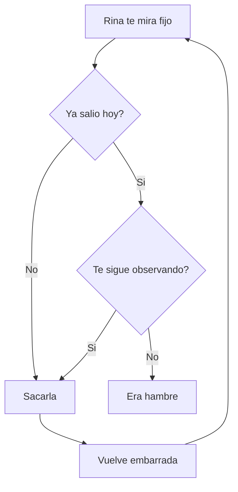

# Cuando lo que apuntas es código

La otra página te enseñaba qué es una página. Esta te enseña para qué sirven de verdad: para el apaño que resolviste a las once de la madrugada y que dentro de seis meses no vas a recordar.

Un bloque de código se colorea según su lenguaje, y con `title=` le pones el nombre del archivo. Escribe `/` y elige **Bloque de código**.

```rust title="src/walk.rs"
fn time_to_take_her_out(hour: u8, been_out: bool) -> bool {
    match (hour, been_out) {
        (7..=9, false) => true,
        (20..=22, false) => true,
        _ => false,
    }
}
```

Eso de arriba es Rust, que es de lo que está hecho Tisty. Y esto es lo mismo contado como un flujo, que a veces se entiende antes de un vistazo:



Los ajustes de un programa, en JSON, con sus colores:

```json title="settings.json"
{
  "language": "es",
  "walks": ["08:00", "21:00"],
  "remind": true,
  "vet": { "name": "South Clinic", "phone": "+56 9 1234 5678" }
}
```

Una consulta que escribiste una vez y funcionó:

```sql title="spending.sql"
SELECT month, SUM(amount) AS total
FROM spending
WHERE category = 'vet'
GROUP BY month
ORDER BY total DESC;
```

El comando que nunca recuerdas:

```bash title="backup.sh"
rsync -a --delete ~/Tisty/ /Volumes/Backup/Tisty/
```

Y lo que cambió entre lo que funcionaba y lo que no:

```diff
- const WALKS: u8 = 1;
+ const WALKS: u8 = 2;
```

> [!TIP]
> El nombre del archivo se ve en la cabecera del bloque y llega también al PDF. Si imprimes esta página, los colores van con ella.

Cuando el código va dentro de una frase, va entre acentos graves: `cargo build --release`, `Ctrl` + `C`, `~/.config/tisty`. Eso es código en línea, y no se colorea porque no hace falta.

Un apunte que vale más que el código: escribe debajo **por qué** era así. El bloque te dice qué hiciste; la línea de después te dice por qué, que es lo que de verdad se olvida.
