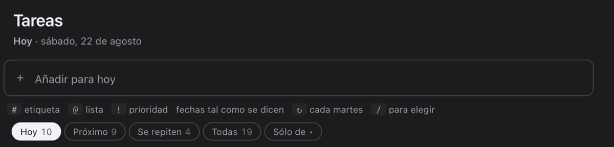
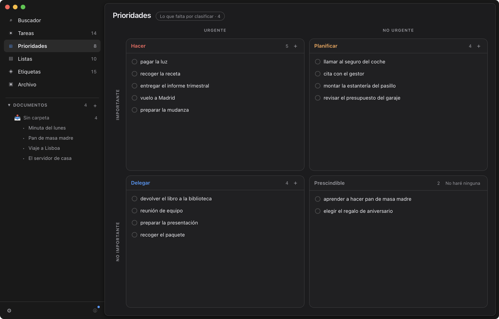
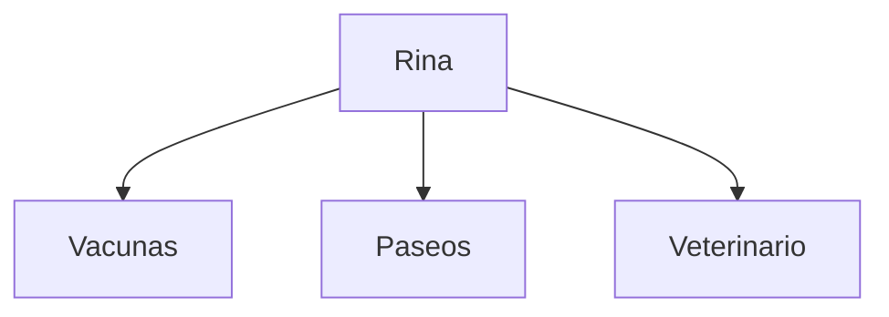
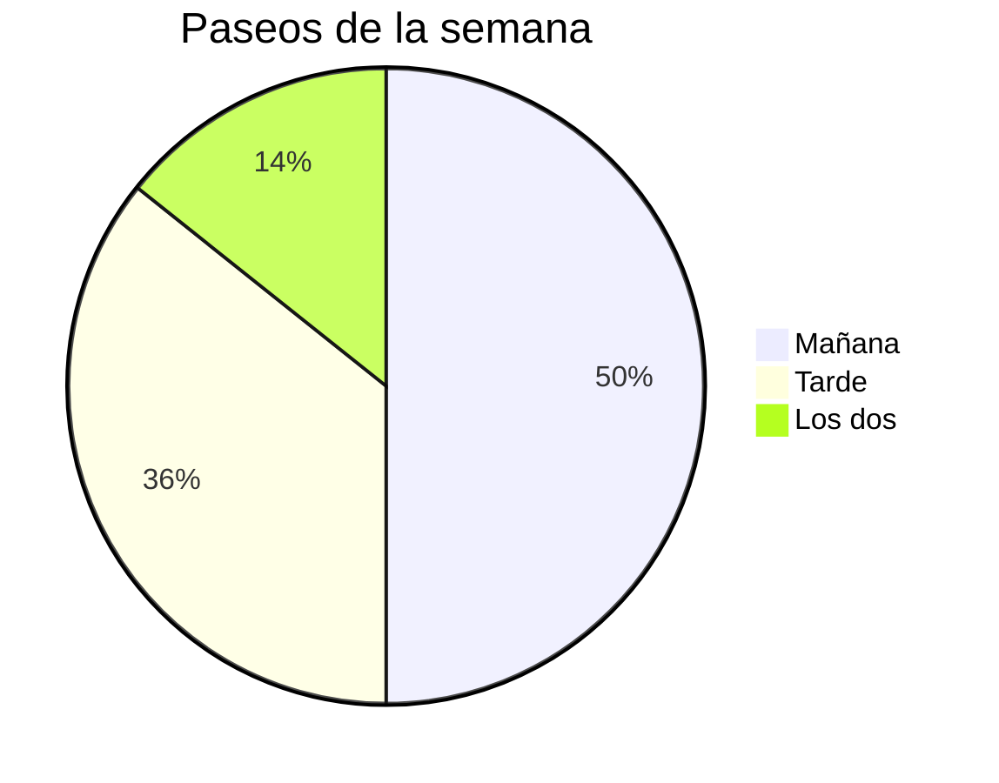
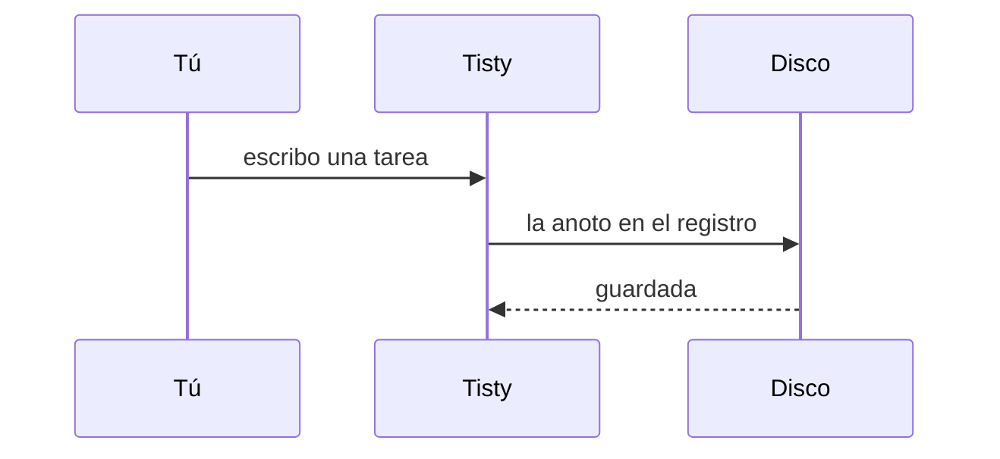

# Cómo funciona Tisty

Tisty es Opensource. Puedes leerlo tú mismo, compilarlo, probarlo o descargar las versiones ya distribuidas y estables. No hay nada oculto: todo es auditable.

Trabajamos constantemente en mejoras y funciones nuevas, pero queremos que siga siendo minimalista y útil. No vamos a sobrecargarlo con mil cosas que nadie va a usar, como hacen otras herramientas comerciales.

Tisty no es un TODO como lo conoces. Es un historial de aprendizaje y conocimiento, con estadísticas y búsquedas sobre tu propio trabajo. ¿Cómo resolviste eso? ¿No te acuerdas? Tisty lo tiene.

Todo local, sin cuentas, sin suscripciones y sin telemetría: tus datos son tuyos. Crea notas en Markdown, documentación, recordatorios y mucho más. Es tu cuaderno personal y de trabajo, privado.

Y si trabajas con un asistente, tiene una puerta por MCP para leer tus documentos, escribir uno nuevo o proponerte tareas. El programa que la abre corre en esta máquina. Cerrar y borrar no puede.

Esta guía te tomará un par de minutos y podrás conocer un poco más de qué puedes hacer en Tisty. Puedes volver a ella cuando quieras desde Ajustes.

---

## Las tareas

### 1. Escribe como hablas

No hay formulario que rellenar. Escribe la frase entera en la barra de arriba y Tisty va separando el día, la lista y la prioridad mientras la escribes.



Cada color dice qué entendió, y son estos:

| Escribes | Entiende |
| --- | --- |
| <mark data-pen="blue">mañana 10am</mark> | día y hora, dichos como se dicen |
| <mark data-pen="blue">el viernes</mark> | el próximo que venga |
| <mark data-pen="pink">cada martes</mark> | algo que vuelve solo |
| <mark data-pen="pink">#casa</mark> | una etiqueta: de qué va |
| <mark data-pen="green">@trabajo</mark> | una lista: dónde ocurre |
| ==!planificar== | hacer, planificar, delegar o prescindible |

Si una parte no se colorea, se queda en el título, que tampoco es grave.

Prueba con estas:

- `Vacuna de Rina el 3 de octubre !hacer #salud`
- `Sacar a Rina cada mañana`
- `Revisar el informe el viernes @trabajo`

### 2. Captura sin abrir la ventana

Presiona `Ctrl` + `Shift` + `Space` desde donde estés y se abre una ventanita para escribir una tarea. Enter la guarda, Esc la cierra, y sigues con lo tuyo.

Si ese atajo ya lo usa otro programa, Tisty prueba con otro y te dice cuál quedó en Ajustes.

### 3. El día de hoy

La lista de tareas se mira por tramos:

- **Hoy** — lo que toca, incluido lo que se pasó de fecha.
- **Próximo** — lo que viene.
- **Se repiten** — lo que vuelve por su cuenta.
- **Todas** — todo lo abierto, sin filtro.

Lo vencido aparece arriba y en rojo. No hay premios por vaciar la lista.

### 4. Las prioridades son un mapa, no una escalera

Dos preguntas, cuatro casillas: si corre prisa y si importa.



- **Hacer** — urgente e importante. Hoy.
- **Planificar** — importante, sin prisa. Ponle fecha antes de que se vuelva urgente.
- **Delegar** — corre, pero no es tuyo. Que lo lleve quien deba.
- **Prescindible** — ni corre ni importa. Ese cuadrante tiene su propio «No haré ninguna».

Arrastra una tarea al cuadrante que le toque. Lo que no clasificas espera en la bandeja de al lado, sin regañarte.

### 5. Listas y etiquetas

Dos formas de ordenar que no compiten:

- Una **lista** dice dónde ocurre: <mark data-pen="green">@casa</mark>, <mark data-pen="green">@trabajo</mark>. Una tarea está en una sola.
- Una **etiqueta** dice de qué va: <mark data-pen="pink">#salud</mark>, <mark data-pen="pink">#compras</mark>. Una tarea lleva las que quieras.

### 6. Lo que queda escrito

Una tarea guarda más que su título. Ponle una descripción, apunta en su diario lo que fuiste averiguando y déjale los pasos que seguiste. Al terminarla nada de eso se borra: se archiva con su fecha.

Ahí está la diferencia. La lista te dice qué falta; el archivo te dice cómo lo resolviste la última vez. Búscalo por una palabra que recuerdes y sale, aunque lo cerraras hace dos años.

---

## Los documentos

### 7. Un documento

Un documento es texto tuyo, guardado en Markdown, que puedes escribir aquí o leer con cualquier otro programa. El archivo es lo que vale: si mañana borras Tisty, tus documentos siguen abriéndose en cualquier editor de texto.

**Para hacer uno**, ve a Documentos y usa el **+** de arriba: **Documento nuevo**. Ese mismo botón, dentro de una carpeta, lo crea ahí. Con **Carpeta nueva** las agrupas, y una carpeta puede tener carpetas dentro.

La primera línea del documento es su título. No hay que ponerle nombre en ninguna parte: lo que escribas arriba es como se llama.

Escribe `/` en cualquier punto y sale el menú de lo que cabe dentro. Además:

- Arrastra un archivo dentro para adjuntarlo — la foto del veterinario, el PDF del seguro.
- Inserta **otro documento**, que entra como una tarjeta que se puede abrir.
- Centra un párrafo o llévalo a la derecha.
- Imprime, o guarda en PDF, desde el propio panel.

### 8. Lo que cabe dentro de un documento

Todo lo de aquí abajo es Markdown corriente. Lo escribes con `/`, y el archivo que queda en el disco lo entiende GitHub igual que Tisty. Esta sección no lo cuenta: te lo enseña.

#### Lo de siempre

**Negrita**, *cursiva*, ~~tachado~~, <u>subrayado</u>, `código suelto` y un [enlace a una web](https://github.com/rgdevment/Tisty). Listas con viñetas, numeradas, y citas de las de toda la vida:

> Lo que no está escrito, no ocurrió.

1. Primero esto
2. Después lo otro
3. Y al final lo de más allá

#### Avisos

Cinco tipos, cada uno con su color. Por dentro es una cita que empieza por su nombre entre corchetes, que es como los escribe GitHub.

> [!NOTE]
> Para lo que conviene saber, sin urgencia ninguna.

> [!TIP]
> Si ya estás dentro de un aviso y eliges otro tipo, cambia el que hay en vez de meter uno dentro de otro.

> [!IMPORTANT]
> Para lo que no se puede pasar por alto.

> [!WARNING]
> Para lo que puede salir mal si no miras.

> [!CAUTION]
> Para lo que no tiene vuelta atrás.

Y dentro de un aviso cabe casi todo, no solo texto:

> [!TIP]
> Los pasos de un respaldo a mano:
>
> - Cerrar Tisty
> - Copiar la carpeta entera
>
> ```bash
> cp -r ~/Tisty ~/Backup
> ```
>
> ---
>
> Todo esto llega igual al PDF.

#### Destacar

Cuatro colores de rotulador: ==amarillo==, <mark data-pen="green">verde</mark>, <mark data-pen="blue">azul</mark> y <mark data-pen="pink">rosa</mark>. Eliges el color en la barra que sale al seleccionar texto.

#### Iconos

<span data-ico="dog" data-hue="orange">:dog:</span> Un icono se busca por lo que dibuja, y en español: pide «perro», «moto» o «puño» y sale el que esperas. Sirve para marcar una línea sin gastar un título en ella.

#### Pasos

Una lista de casillas que se marcan. No son tareas de Tisty: no se cierran, no tienen fecha y no salen en Hoy. Son los pasos de algo que estás escribiendo.

- [x] Llevar la cartilla de Rina
- [x] Pesarla antes de la consulta
- [ ] Preguntar por la pastilla de las garrapatas

#### Tablas

Una tabla se puede trabajar: añadir filas y columnas, alinear a izquierda, centro o derecha, y estirar el ancho de una columna arrastrando su borde.

| Vacuna | Puesta | Toca otra vez |
| :--- | :---: | ---: |
| Séxtuple | marzo | 12 meses |
| Antirrábica | marzo | 12 meses |
| Desparasitación | agosto | 3 meses |

El ancho viaja en lo larga que se dibuja la raya de debajo del encabezado, así que cualquier otro lector de Markdown ve una tabla normal y Tisty ve el ancho que le diste.

#### Diagramas

Un bloque de código cuyo lenguaje es `mermaid` deja de ser código y se dibuja. Sirve para un esquema:



Para repartir un total:



O para contar quién habla con quién:



#### Fórmulas

Y un bloque cuyo lenguaje es `math` compone la fórmula.

```math
dosis = \frac{peso \times 0.5}{2}
```

```math
\sum_{i=1}^{n} i = \frac{n(n+1)}{2}
```

Las dos cosas se dibujan con código que viaja dentro de Tisty. No se pide nada a internet, y funcionan con el cable desenchufado.

#### Código, con nombre y con color

Un bloque de código se colorea según su lenguaje, y le puedes poner nombre: escribe el lenguaje y después `title="lo que sea"`. El nombre se ve en la cabecera del bloque, y el color llega también al PDF.

```bash title="backup.sh"
rsync -a ~/Tisty/ /Volumes/Backup/Tisty/
```

```json title="settings.json"
{ "language": "es", "folder": "~/Tisty" }
```

#### Salto de página

Una raya sola parte la hoja. En pantalla se ve como un corte de verdad, y al imprimir o guardar en PDF lo que sigue empieza en la hoja siguiente. Es lo único de esta lista que no se nota leyendo, sino imprimiendo.

De código hay más que decir, y cabe en su propia hoja:


---

Esto de aquí ya va en la hoja de después.

### 9. Un documento con páginas

Un año de actas, un libro por capítulos, la vida de un perro contada año a año. Eso no cabe en un solo papel, y tampoco en una carpeta de papeles sueltos que no ata nada.

Una página es un documento como cualquier otro —mismo archivo en el disco, misma salida— con una sola cosa que la distingue: dice de qué documento es. Hay un nivel y no más: una página no tiene páginas.

**Para añadirle una**, escribe `/` donde quieras que empiece ese capítulo y elige **Una página nueva**, o **Una página que ya existe** si el documento ya está escrito. Queda nombrada ahí mismo, dibujada como un hueco en la hoja con lo que esa página contiene debajo.

> [!IMPORTANT]
> El orden en que están nombradas en el texto es el orden en que van las páginas: en el árbol, en la exportación y al imprimir. Mover un capítulo es cortar y pegar su bloque.

Al final del documento, en su propia hoja, va el índice: las páginas que el texto nombra, numeradas, y tras una raya las que no, a un clic de tener su sitio en el texto. Dentro de una página verás arriba de qué documento es y en qué lugar va, flechas a sus hermanas, y abajo el paso a la siguiente.

En el árbol, un documento soltado encima de otro se vuelve página suya.

Esta guía tiene una. Aquí debajo está nombrada, y por eso aquí es donde va:


### 10. Cuando Tisty solo puede leerlo

Tisty escribe Markdown de vuelta, y unas pocas formas no sobreviven ese viaje: la cabecera del principio, las notas al pie, los enlaces escritos por referencia, el HTML y sus comentarios, y algún caso raro de las vallas de código y de las listas.

Antes que abrirlo y destruirte eso en la primera tecla, Tisty lo dice y lo abre para leer. La barra de abajo ofrece convertirlo —lo reescribe a lo que sí sabe conservar y guarda una copia de cómo estaba— y si la conversión no puede con todo, **Editarlo igualmente** te lo abre con el aviso a la vista. Nunca te quedas encerrado.

---

## Lo que vale para todo

### 11. Un asistente puede escribir aquí

Si usas un asistente, puede archivar documentos y proponer tareas por su cuenta. Lo que no puede es cerrar, borrar ni tocar lo que tú escribiste.

Para reescribir un documento entero se le entrega una huella del texto exacto que leyó, y tiene que devolverla al escribir. Si escribiste tú en medio, la huella ya no cuadra: no se escribe nada y se le dice que vuelva a leerlo. La ventana te avisa cuando algo ha escrito en el documento que tienes abierto.

### 12. Tus copias

Tisty trabaja siempre en este equipo. Si quieres alcanzarlo desde otro, dile dónde dejar las copias: te ofrece Google Drive, OneDrive, iCloud y Dropbox —los que encuentre instalados, con su carpeta ya resuelta— o cualquier otra que los dos equipos alcancen, un NAS o un disco externo.

Quien sube y baja esa carpeta es el programa de tu proveedor, no Tisty. Si no está en marcha, las tareas esperan ahí hasta que lo esté.

> No hay servidor nuestro por medio. Sincronizar te da redundancia, no vuelta atrás en el tiempo: si borras una tarea, el borrado también viaja.

En Ajustes puedes además guardar un respaldo completo cuando quieras.

### 13. Terminar, descartar y borrar

- **Terminar** una tarea la marca hecha y la manda al Archivo.
- **Descartar** la aparta sin hacerla: también acaba en el Archivo.
- Lo del Archivo sigue ahí por si lo buscas. No estorba.

> **Antes de borrar de verdad.** Solo se puede con lo que ya está archivado **y** apartado de la vista. Al borrar desaparece de este equipo y de los demás en la siguiente sincronización, y no hay deshacer.

Los archivos que hubieras adjuntado no se van con ella, porque podrían estar en uso en otro documento. Quedan sueltos, y Ajustes → Mantenimiento te los lista para soltarlos cuando quieras.

Ahí mismo está **Revisar el almacén**: cuenta lo que sobra, lo que falta y lo que puedes recuperar, y no cambia nada por su cuenta. Los adjuntos que ya no nombra nadie se van a la papelera con treinta días para arrepentirte. Los documentos que están en el disco pero el registro no nombra se apartan para mirarlos primero, porque pueden ser la única copia de algo que perdió su evento: recogerlos nunca puede estar mal.

### 14. Atajos

| Atajo | Qué hace |
| --- | --- |
| `Ctrl` + `Shift` + `Space` | Capturar sin abrir la ventana |
| `Ctrl`/`⌘` + `Enter` | Terminar la tarea señalada |
| `/` | Insertar dentro de un documento |
| `Ctrl`/`⌘` + `X` · `V` | Mover un documento entre carpetas |
| `Esc` | Cerrar lo que esté abierto |

### 15. Si te sirvió

Tisty es de código abierto y se lee entero en
[github.com/rgdevment/Tisty](https://github.com/rgdevment/Tisty): ahí van los
fallos que encuentres y las ideas que se te ocurran.

En [el mismo perfil](https://github.com/rgdevment) hay dos herramientas más, con
la misma idea y los mismos términos —gratis, abiertas, sin anuncios, sin
telemetría, todo en tu equipo—:

- **[CopyPaste](https://github.com/rgdevment/CopyPaste)** — un gestor de
  portapapeles para Windows, macOS y Linux.
- **[LinkUnbound](https://github.com/rgdevment/LinkUnbound)** — un selector de
  navegadores para Windows y macOS: pregunta cuál debe abrir un enlace en vez de
  suponerlo.
