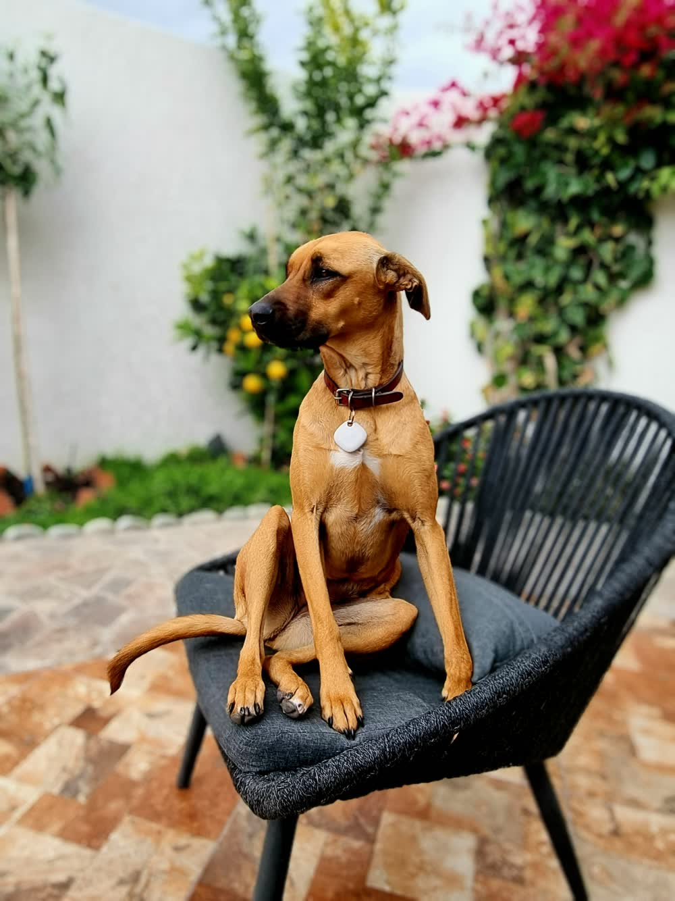

# La Rina

Esta hoja es una página de la guía. No está aquí para contarte nada de Tisty: está para que veas por dentro lo que la sección anterior te explicaba.

Fíjate en tres cosas que solo se ven estando dentro de una.

Arriba tienes de qué documento es esta página y en qué lugar va, con flechas a sus hermanas si las tuviera. Es un documento igual que cualquier otro —el mismo archivo en el disco, la misma salida al exportar— y lo único que lo distingue es esa línea: dice de quién es.

En el texto de la guía, esta hoja no está pegada al final. Está nombrada justo donde tenía sentido nombrarla, y ahí es donde va. Si mueves ese bloque de sitio, la página se mueve con él: en el árbol, al imprimir y al exportar.

Y la foto de arriba viaja con el documento. No es un enlace a una carpeta de tu disco que se romperá cuando muevas el archivo: la imagen está guardada dentro de Tisty, y sale con la página cuando la exportas.

> [!TIP]
> Prueba a borrar la línea que nombra esta página en la guía. La página no desaparece: se queda sin sitio en el texto y baja al índice del final, esperando a que la vuelvas a poner donde quieras.

Un año de actas, un libro por capítulos, la vida de una perra contada año a año. Esto es lo que era.
